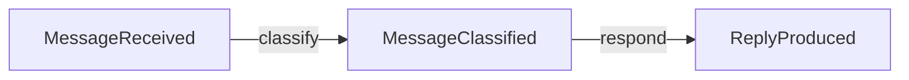

# langgraph-events

Opinionated event-driven abstraction for LangGraph. **State IS events.**

> **Experimental (v0.1.1)** — This library is under active development. The API may change without notice. Not recommended for production use.

## What is this?

LangGraph gives you full control over agent topology, but wiring `StateGraph` nodes and conditional edges by hand is tedious and error-prone.

**langgraph-events** replaces that boilerplate with a reactive, event-driven model. Define domain events as frozen dataclasses, subscribe handler functions with `@on(EventType)`, and let `EventGraph` derive the full graph topology automatically.

The core principle: **state IS events.** The entire state of a run is an append-only log of typed, immutable events. Handlers read events in; handlers emit events out. The framework does the rest.

## Installation

```bash
pip install git+https://github.com/cadance-io/langgraph-events.git
```

Requires Python 3.10+ and `langgraph >= 0.2.0` (installed automatically).

## Quick Start

```python
from langgraph_events import Event, EventGraph, on

# 1. Define events (auto-frozen dataclasses — no decorator needed)
class MessageReceived(Event):
    text: str

class MessageClassified(Event):
    label: str

class ReplyProduced(Event):
    text: str

# 2. Subscribe handlers with @on
@on(MessageReceived)
def classify(event: MessageReceived) -> MessageClassified:
    if "help" in event.text.lower():
        return MessageClassified(label="support")
    return MessageClassified(label="general")

@on(MessageClassified)
def respond(event: MessageClassified) -> ReplyProduced:
    if event.label == "support":
        return ReplyProduced(text="Routing you to support...")
    return ReplyProduced(text="Thanks for your message!")

# 3. Build the graph and run
graph = EventGraph([classify, respond])
log = graph.invoke(MessageReceived(text="I need help with my order"))

print(log.latest(ReplyProduced))
# ReplyProduced(text='Routing you to support...')
```

## How It Works

`EventGraph` compiles your handlers into a LangGraph `StateGraph` with a hub-and-spoke reactive loop:

```
seed event
    │
    v
[__seed__] ──> [dispatch] ──> handler_a ──┐
                   ^           handler_b ──┤
                   │                       │
                [__router__] <─────────────┘
                   │
                   v
                [dispatch] ──> handler_c ──┐
                   ^                       │
                   │                       │
                [__router__] <─────────────┘
                   │
                   v
                [dispatch] ──> END (no pending events)
```

1. A **seed event** enters the graph.
2. The **router** collects new events, then **dispatch** uses `isinstance` to match each pending event to subscribed handlers.
3. Matched handlers run, emit new events.
4. The loop repeats until no handler matches or a `Halt` event appears.

## Key Concepts

### Events

Events are frozen dataclasses that extend `Event`. Immutability guarantees a safe append-only log. Subclasses are automatically made into frozen dataclasses — no decorator needed:

```python
class OrderPlaced(Event):
    order_id: str
    total: float
```

Events support **inheritance**. A handler subscribed to a parent type fires for all subtypes (`isinstance` matching). The built-in `Auditable` marker class is a common example — subscribe once with `@on(Auditable)` and every marked event is captured automatically:

```python
from langgraph_events import Auditable, on

class OrderPlaced(Auditable):
    order_id: str

class OrderShipped(Auditable):
    order_id: str

@on(Auditable)
def audit(event: Auditable) -> None:
    # Fires for OrderPlaced, OrderShipped, and any Auditable subtype
    print(event.trail())
```

### `@on(*EventTypes)`

Decorate a function with `@on(EventType)` to subscribe it. Handlers receive the matching event and optionally an `EventLog`. They return a single `Event`, `None` (side-effect only), or `Scatter`.

```python
@on(UserMessage)
def greet(event: UserMessage) -> Greeting:
    return Greeting(text=f"Hello!")
```

**Multi-subscription** — a single handler fires on multiple event types:

```python
@on(UserMessage, ToolResult)
def call_llm(event: Event, log: EventLog) -> AssistantMessage:
    history = log.filter(Event)
    ...
```

### `EventGraph`

The main entry point. Pass a list of handler functions and `EventGraph` derives the topology.

```python
graph = EventGraph(
    [classify, respond, audit],
    max_rounds=50,
    reducers=[my_reducer],      # optional — see Reducer section
)

# Single seed event
log = graph.invoke(SeedEvent(...))

# Multiple seed events (e.g. system prompt + user message)
log = graph.invoke([
    SystemPromptSet.from_str("You are helpful"),
    UserMessageReceived(message=HumanMessage(content="Hi")),
])

# Asynchronous
log = await graph.ainvoke(SeedEvent(...))

# High-level event streaming
for event in graph.stream_events(SeedEvent(...)):
    print(event)  # yields Event objects directly

# Stream with reducer snapshots
for event, reducers in graph.stream_events(SeedEvent(...), include_reducers=True):
    print(event, reducers["messages"])  # accumulated reducer state

# Low-level streaming (pass-through to LangGraph)
for chunk in graph.stream(SeedEvent(...), stream_mode="updates"):
    print(chunk)
```

`max_rounds` (default: 100) prevents infinite loops. `reducers` accepts an optional list of `Reducer` instances for incremental state channels.

#### Visualizing the Event Flow

`graph.mermaid()` returns a Mermaid flowchart showing how events correlate through handlers. Events are nodes, handler names are edge labels, and side-effect handlers (returning `None`) are listed in a footer comment.

```python
# Visualize the event correlation graph
print(graph.mermaid())
```



### `EventLog`

Immutable, ordered container returned by `invoke`/`ainvoke`. Handlers can also receive it as a second parameter.

```python
@on(Draft)
def evaluate(event: Draft, log: EventLog) -> Critique | FinalDraft:
    request = log.latest(WriteRequest)   # most recent event of this type
    all_drafts = log.filter(Draft)       # all events matching this type
    if log.has(Critique):                # boolean check
        ...
```

| Method          | Returns    | Description                          |
|-----------------|------------|--------------------------------------|
| `log.filter(T)` | `list[T]` | All events matching type `T`         |
| `log.latest(T)` | `T \| None` | Most recent event of type `T`      |
| `log.has(T)`    | `bool`     | Whether any event of type `T` exists |
| `len(log)`      | `int`      | Total event count                    |
| `log[i]`        | `Event`    | Index or slice access                |

### `Halt`

Return a `Halt` event from any handler to immediately stop the graph. No further handlers are dispatched.

```python
@on(Classified)
def guard(event: Classified) -> Reply | Halt:
    if event.label == "blocked":
        return Halt(reason="Content policy violation")
    return Reply(text="OK")
```

### `Scatter`

Return `Scatter([event1, event2, ...])` to fan-out into multiple events. Each becomes a separate pending event, dispatched in the next round.

```python
@on(Batch)
def split(event: Batch) -> Scatter:
    return Scatter([WorkItem(item=i) for i in event.items])

@on(WorkItem)
def process(event: WorkItem) -> WorkDone:
    return WorkDone(result=f"done:{event.item}")

@on(WorkDone)
def gather(event: WorkDone, log: EventLog) -> BatchResult | None:
    all_done = log.filter(WorkDone)
    batch = log.latest(Batch)
    if len(all_done) >= len(batch.items):
        return BatchResult(results=tuple(e.result for e in all_done))
    return None  # not all items done yet
```

### `Auditable`

Marker base class for events that should be auto-logged. Subclass it and subscribe a single `@on(Auditable)` handler to capture every marked event automatically. The built-in `trail()` method returns a compact summary of the event's fields.

```python
class TaskStarted(Auditable):
    name: str

@on(Auditable)
def log_event(event: Auditable) -> None:
    print(event.trail())
    # "[TaskStarted] name='deploy'"
```

### `MessageEvent`

Base class for events that wrap LangChain `BaseMessage` objects. Declare a `message` field (single message) or `messages` field (tuple of messages), and `as_messages()` auto-converts them. Pairs with `message_reducer()` for automatic message history accumulation.

```python
from langchain_core.messages import HumanMessage, AIMessage

class UserMessageReceived(MessageEvent, Auditable):
    message: HumanMessage

class LLMResponded(MessageEvent, Auditable):
    message: AIMessage
```

### `SystemPromptSet`

Built-in `MessageEvent` that wraps a `SystemMessage`. Makes the system prompt a first-class citizen in the event log — visible, queryable, and auditable.

```python
from langgraph_events import SystemPromptSet, message_reducer, EventGraph

messages = message_reducer()  # no default needed — system prompt is a seed event

graph = EventGraph([call_llm, execute_tools], reducers=[messages])

log = graph.invoke([
    SystemPromptSet.from_str("You are a helpful assistant with tools."),
    UserMessageReceived(message=HumanMessage(content="What's the weather?")),
])

# The system prompt is now in the event log
assert log.has(SystemPromptSet)
```

You can also construct it explicitly with a `SystemMessage`:

```python
from langchain_core.messages import SystemMessage

seed = SystemPromptSet(message=SystemMessage(content="You are helpful"))
```

### `Reducer` / `message_reducer`

A `Reducer` maps events to contributions for a named LangGraph state channel. The framework maintains the channel incrementally — handlers receive the accumulated value by declaring a parameter whose name matches the reducer.

```python
from langgraph_events import Reducer, EventGraph, on

def project(event: Event) -> list:
    if isinstance(event, UserMsg):
        return [event.text]
    return []

history = Reducer("history", fn=project, default=[])

@on(UserMsg)
def respond(event: UserMsg, history: list) -> Reply:
    # history contains all projected values so far
    ...

graph = EventGraph([respond], reducers=[history])
```

`message_reducer()` is a built-in factory for the common case of accumulating LangChain messages from `MessageEvent` instances:

```python
from langgraph_events import message_reducer, SystemPromptSet

# Preferred: system prompt as a seed event (visible in the event log)
messages = message_reducer()
graph = EventGraph([call_llm, handle_tools], reducers=[messages])
log = graph.invoke([
    SystemPromptSet.from_str("You are a helpful assistant."),
    UserMessageReceived(message=HumanMessage(content="Hi")),
])

# Alternative: explicit default list
messages = message_reducer([SystemMessage(content="You are a helpful assistant.")])
```

The parameter name `messages` matches the reducer name, so the framework injects the accumulated message list automatically:

```python
@on(UserMessageReceived, ToolsExecuted)
async def call_llm(event: Event, messages: list[BaseMessage]) -> LLMResponded:
    response = await llm.ainvoke(messages)
    ...
```

### `Interrupted` / `Resumed`

Return an `Interrupted` event to pause the graph and wait for human input. When the graph is resumed (via LangGraph's `Command(resume=value)`), the framework creates a `Resumed` event containing the human's response.

Requires a **checkpointer** (e.g., `MemorySaver`).

```python
from langgraph.checkpoint.memory import MemorySaver
from langgraph.types import Command

@on(OrderPlaced)
def confirm(event: OrderPlaced) -> Interrupted:
    return Interrupted(
        prompt=f"Approve order {event.order_id} for ${event.total}?",
        payload={"order_id": event.order_id},
    )

@on(Resumed)
def finalize(event: Resumed) -> OrderConfirmed | OrderCancelled:
    if event.value == "yes":
        # interrupted is always set by the framework when resuming
        return OrderConfirmed(order_id=event.interrupted.payload["order_id"])
    return OrderCancelled(reason="User declined")

graph = EventGraph([confirm, finalize])
compiled = graph.compile(checkpointer=MemorySaver())
config = {"configurable": {"thread_id": "order-1"}}

# First call — pauses at the interrupt
compiled.invoke({"events": [OrderPlaced(order_id="A1", total=99.99)]}, config)

# Resume with human input
result = compiled.invoke(Command(resume="yes"), config)
```

## Patterns & Examples

The patterns below show how these building blocks compose into complete architectures. Each links to a runnable example in `examples/`.

### Reflection Loop (Generate / Critique / Revise)

A handler subscribes to both the seed event and critique events (`@on(WriteRequest, Critique)`), creating an autonomous improvement cycle. A second handler evaluates each draft and either produces a critique (looping back) or a final result (terminating). `EventLog.latest()` provides lookback to enforce a revision cap.

[`examples/reflection_loop.py`](examples/reflection_loop.py) · [event flow](examples/reflection_loop.graph.md) — Multi-subscription `@on`, `EventLog.latest()`, revision cap

### ReAct Agent with Message Reducer

Multi-subscription (`@on(UserMessageReceived, ToolsExecuted)`) creates the ReAct loop implicitly. The `message_reducer` maintains conversation history incrementally — handlers receive the accumulated message list as a parameter rather than reconstructing it from the event log.

[`examples/react_agent.py`](examples/react_agent.py) · [event flow](examples/react_agent.graph.md) — `MessageEvent`, `message_reducer`, `Auditable`

### Multi-Agent Supervisor

A supervisor handler fires on the initial task and on specialist completions (`@on(TaskReceived, ResearchCompleted, CodeProduced)`). It uses tool-calling to make structured routing decisions. A custom `Reducer` projects events into a context channel that the supervisor reads incrementally.

[`examples/supervisor.py`](examples/supervisor.py) · [event flow](examples/supervisor.graph.md) — Custom `Reducer`, tool-calling routing, `Auditable`

### Fan-Out / Fan-In (Map-Reduce)

`Scatter` fans a batch into individual work items. Per-item handlers process in parallel. A gathering handler uses `EventLog.filter()` to detect completion and produce the combined result.

[`examples/map_reduce.py`](examples/map_reduce.py) · [event flow](examples/map_reduce.graph.md) — `Scatter`, `EventLog.filter()`, gather pattern

### Human-in-the-Loop Approval

`Interrupted` pauses the graph for human input. `Resumed` carries the response back in. Combined with a revision event type, this creates an approval-with-feedback cycle. Requires a checkpointer.

[`examples/human_in_the_loop.py`](examples/human_in_the_loop.py) · [event flow](examples/human_in_the_loop.graph.md) — `Interrupted`/`Resumed`, checkpointer, revision cycle

### Content Pipeline (Halt + Streaming)

`Halt` terminates the pipeline immediately for unsafe content. `stream_events()` yields events as they're produced, with optional `StreamFrame` reducer snapshots. No LLM dependency — runs with keyword rules.

[`examples/content_pipeline.py`](examples/content_pipeline.py) · [event flow](examples/content_pipeline.graph.md) — `Halt`, `Reducer`, `stream_events`, `StreamFrame`

## API Reference

| Export            | Type       | Description                                     |
|-------------------|------------|-------------------------------------------------|
| `Auditable`       | Base class | Marker class for auto-logged events             |
| `Event`           | Base class | Subclass to define events (auto-frozen)         |
| `EventGraph`      | Class      | Build and run the event-driven graph            |
| `EventGraph.mermaid()` | Method | Return a Mermaid flowchart of event correlations |
| `EventLog`        | Class      | Immutable query container over events           |
| `Halt`            | Event      | Signal immediate graph termination              |
| `Interrupted`     | Event      | Pause graph for human input                     |
| `MessageEvent`    | Base class | Mixin for events wrapping LangChain messages    |
| `message_reducer` | Function   | Built-in reducer for `MessageEvent` projection  |
| `on`              | Decorator  | Subscribe a handler to one or more event types  |
| `Reducer`         | Class      | Map events to a named LangGraph state channel   |
| `Resumed`         | Event      | Created on resume with human's response         |
| `Scatter`         | Class      | Fan-out into multiple events (map-reduce)       |
| `StreamFrame`     | NamedTuple | `(event, reducers)` yielded by `stream_events()` with `include_reducers` |
| `SystemPromptSet` | Event      | Built-in `MessageEvent` for system prompts      |

## Checkpointer & Graph Evolution

When using a checkpointer (`MemorySaver`, `SqliteSaver`, etc.), existing threads retain their checkpoint state across invocations. If you modify the graph between invocations on the same thread, LangGraph handles mismatches through **graceful degradation** — no crashes, but some changes have silent side effects.

### What's safe

| Change | Behavior |
|---|---|
| **Add a handler** | Safe. `dispatch()` is rebuilt from current handlers, so the new handler participates immediately. |
| **Add an event type** | Safe. New events can be emitted and matched normally. |
| **Remove an event type** | Safe. Existing events stay in the log but no handler will match them — they're inert. |

### What to watch out for

| Change | Risk |
|---|---|
| **Remove a handler** (normal checkpoint) | Events that *only* the removed handler subscribed to become undeliverable. The graph halts early — no crash, but incomplete execution. |
| **Remove a handler** (interrupted checkpoint) | If the graph was paused inside the removed handler via `Interrupted`, the `Command(resume=value)` silently does nothing. The pending Send to the missing node is dropped. The human-in-the-loop flow breaks without error. |
| **Rename a handler** | Same as remove + add. If an `Interrupted` checkpoint targeted the old name, the resume is lost. |
| **Add a reducer** | The new reducer starts cold — it **misses its default values and all historical event projections**. Only events added after the resume point contribute. |
| **Remove a reducer** | The reducer's channel data is silently dropped from the checkpoint. |

### Best practices

1. **Don't rename handlers with active interrupted threads.** If a thread is paused at an `Interrupted` checkpoint, the handler's function name is baked into the checkpoint. Renaming it silently breaks resume.
2. **Treat reducer addition as a fresh start.** A newly added reducer on an existing thread won't replay historical events. If you need the full history, start a new thread.
3. **Prefer additive changes.** Adding handlers and event types is always safe. Removing them is safe only if no in-flight threads depend on them.
4. **Use separate `thread_id`s after structural changes.** The simplest way to avoid all edge cases is to use a new thread for a modified graph.

## Development

```bash
git clone https://github.com/cadance-io/langgraph-events.git
cd langgraph-events
uv sync --group dev
uv run pytest
```

## License

MIT — see [LICENSE](LICENSE).
