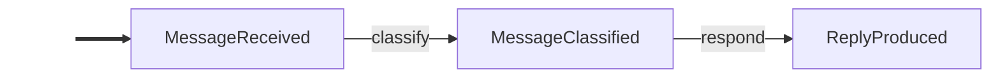

# langgraph-events

Opinionated event-driven abstraction for LangGraph. **State IS events.**

> [!CAUTION]
> **Experimental (v0.1.1)** — This is an early-stage personal project, not a supported product. The API will change without notice or migration path. Do not depend on this for anything you can't easily rewrite. Not published to PyPI.

## What is this?

LangGraph gives you full control over agent topology, but wiring `StateGraph` nodes and conditional edges by hand is tedious. **langgraph-events** replaces that boilerplate with a reactive, event-driven model: define domain events as frozen dataclasses, subscribe handler functions with `@on(EventType)`, and let `EventGraph` derive the full graph topology automatically.

The core principle: **state IS events.** The entire state of a run is an append-only log of typed, immutable events. Handlers read events in; handlers emit events out. The framework does the rest.

## Installation

Not published to PyPI yet. Install directly from GitHub:

```bash
pip install git+https://github.com/cadance-io/langgraph-events.git

# With AG-UI adapter support (installs ag-ui-protocol)
pip install "langgraph-events[agui] @ git+https://github.com/cadance-io/langgraph-events.git"
```

Requires Python 3.10+ and `langgraph >= 0.2.0` (installed automatically). The `[agui]` extra adds `ag-ui-protocol` for the [AG-UI protocol adapter](#ag-ui-protocol-adapter).

## Quick Start

```python
from langgraph_events import Event, EventGraph, on

# 1. Define events (auto-frozen dataclasses — no decorator needed)
class MessageReceived(Event):
    text: str

class MessageClassified(Event):
    label: str

class ReplyProduced(Event):
    text: str

# 2. Subscribe handlers with @on
@on(MessageReceived)
def classify(event: MessageReceived) -> MessageClassified:
    if "help" in event.text.lower():
        return MessageClassified(label="support")
    return MessageClassified(label="general")

@on(MessageClassified)
def respond(event: MessageClassified) -> ReplyProduced:
    if event.label == "support":
        return ReplyProduced(text="Routing you to support...")
    return ReplyProduced(text="Thanks for your message!")

# 3. Build the graph and run
graph = EventGraph([classify, respond])
log = graph.invoke(MessageReceived(text="I need help with my order"))

print(log.latest(ReplyProduced))
# ReplyProduced(text='Routing you to support...')
```

## How It Works

`EventGraph` compiles your handlers into a LangGraph `StateGraph` with a hub-and-spoke reactive loop:

```
seed event
    │
    v
[seed] ──> [dispatch] ──> handler_a ──┐
                ^          handler_b ──┤
                │                      │
             [router] <────────────────┘
                │
                v
             [dispatch] ──> handler_c ──┐
                ^                       │
                │                       │
             [router] <─────────────────┘
                │
                v
             [dispatch] ──> END (no pending events)
```

1. A **seed event** enters the graph.
2. The **router** collects new events, then **dispatch** matches each to subscribed handlers via `isinstance`. Matched handlers run and emit new events.
3. The loop repeats until no handler matches or a `Halted` event appears.

## Key Concepts

### Events

Events are frozen dataclasses that extend `Event`. Immutability guarantees a safe append-only log. Subclasses are automatically made into frozen dataclasses — no decorator needed:

```python
class OrderPlaced(Event):
    order_id: str
    total: float
```

Events support **inheritance**. A handler subscribed to a parent type fires for all subtypes (`isinstance` matching). The built-in `Auditable` marker class is a common example — subscribe once with `@on(Auditable)` and every marked event is captured automatically:

```python
from langgraph_events import Auditable, on

class OrderPlaced(Auditable):
    order_id: str

class OrderShipped(Auditable):
    order_id: str

@on(Auditable)
def audit(event: Auditable) -> None:
    # Fires for OrderPlaced, OrderShipped, and any Auditable subtype
    print(event.trail())
```

### `@on(*EventTypes)`

Decorate a function with `@on(EventType)` to subscribe it. Handlers receive the matching event and optionally an `EventLog`. They return a single `Event`, `None` (side-effect only), or `Scatter`.

```python
@on(UserMessage)
def greet(event: UserMessage) -> Greeting:
    return Greeting(text=f"Hello!")
```

Handlers may also request `config: RunnableConfig` or `store: BaseStore` by type annotation (reducer channels are still injected by parameter name).

**Multi-subscription** — a single handler fires on multiple event types:

```python
@on(UserMessage, ToolResult)
def call_llm(event: Event, log: EventLog) -> AssistantMessage:
    history = log.filter(Event)
    ...
```

### `EventGraph`

The main entry point. Pass a list of handler functions and `EventGraph` derives the topology.

```python
graph = EventGraph(
    [classify, respond, audit],
    max_rounds=50,           # default: 100; prevents infinite loops
    reducers=[my_reducer],   # optional — see Reducer section
)

# Synchronous
log = graph.invoke(SeedEvent(...))

# Multiple seed events
log = graph.invoke([
    SystemPromptSet.from_str("You are helpful"),
    UserMessageReceived(message=HumanMessage(content="Hi")),
])

# Asynchronous
log = await graph.ainvoke(SeedEvent(...))

# Stream events as they're produced
for event in graph.stream_events(SeedEvent(...)):
    print(event)

# Stream with reducer snapshots
for frame in graph.stream_events(SeedEvent(...), include_reducers=True):
    print(frame.event, frame.reducers["messages"])

# Stream events during resume (requires checkpointer)
async for event in graph.astream_resume(ApprovalSubmitted(approved=True), config=config):
    print(event)

# Async stream with real-time LLM token deltas
from langgraph_events import LLMStreamEnd, LLMToken

async for item in graph.astream_events(
    SeedEvent(...),
    include_llm_tokens=True,
):
    if isinstance(item, LLMToken):
        print(item.content, end="")
    elif isinstance(item, LLMStreamEnd):
        print("\n[done]", item.message_id)
    else:
        print(item)

# --- LangGraph escape hatch ---
# Access the underlying CompiledStateGraph for advanced patterns:
# subgraph composition, custom streaming modes, or direct state access.
compiled = graph.compiled
for chunk in compiled.stream({"events": [SeedEvent(...)]}, stream_mode="updates"):
    print(chunk)
```

`max_rounds` (default: 100) prevents infinite loops — the library auto-sets LangGraph's `recursion_limit` so this is the only knob you need. Override via `invoke(seed, recursion_limit=N)` if needed. All methods have async counterparts: `ainvoke()`, `astream_events()`, `aresume()`, `astream_resume()`. Use `include_llm_tokens=True` with `astream_events()`/`astream_resume()` to interleave `LLMToken` and `LLMStreamEnd` frames with normal event output.

#### Visualizing the Event Flow

`graph.mermaid()` returns a Mermaid flowchart showing how events correlate through handlers. Events are nodes, handler names are edge labels, and side-effect handlers (returning `None`) are listed in a footer comment.

```python
# Visualize the event correlation graph
print(graph.mermaid())
```



### `EventLog`

Immutable, ordered container returned by `invoke`/`ainvoke`. Handlers can also receive it as a second parameter.

```python
@on(DraftProduced)
def evaluate(event: DraftProduced, log: EventLog) -> CritiqueReceived | FinalDraftProduced:
    request = log.latest(WriteRequested)        # most recent event of this type
    all_drafts = log.filter(DraftProduced)      # all events matching this type
    if log.has(CritiqueReceived):               # boolean check
        ...
```

| Method               | Returns             | Description                                    |
|----------------------|---------------------|------------------------------------------------|
| `log.filter(T)`      | `list[T]`           | All events of type T                           |
| `log.latest(T)`      | `T \| None`         | Most recent event of type T                    |
| `log.first(T)`       | `T \| None`         | Earliest event of type T                       |
| `log.has(T)`         | `bool`              | Whether any event of type T exists             |
| `log.count(T)`       | `int`               | Number of events matching type T               |
| `log.select(T)`      | `EventLog`          | Filtered log (chainable)                       |
| `log.after(T)`       | `EventLog`          | Events after first occurrence of T             |
| `log.before(T)`      | `EventLog`          | Events before first occurrence of T            |
| `len(log)`           | `int`               | Total events                                   |
| `log[i]`             | `Event`             | Index access                                   |

### `Halted`

Return a `Halted` event from any handler to immediately stop the graph. No further handlers are dispatched.

```python
@on(Classified)
def guard(event: Classified) -> Reply | Halted:
    if event.label == "blocked":
        return Halted(reason="Content policy violation")
    return Reply(text="OK")
```

### `Scatter`

Return `Scatter([event1, event2, ...])` to fan-out into multiple events. Each becomes a separate pending event, dispatched in the next round. Use `Scatter[WorkItem]` to annotate the produced type — this renders as a dashed edge in `mermaid()` diagrams.

```python
@on(Batch)
def split(event: Batch) -> Scatter[WorkItem]:
    return Scatter([WorkItem(item=i) for i in event.items])

@on(WorkItem)
def process(event: WorkItem) -> WorkDone:
    return WorkDone(result=f"done:{event.item}")

@on(WorkDone)
def gather(event: WorkDone, log: EventLog) -> BatchResult | None:
    all_done = log.filter(WorkDone)
    batch = log.latest(Batch)
    if len(all_done) >= len(batch.items):
        return BatchResult(results=tuple(e.result for e in all_done))
    return None  # not all items done yet
```

### `Auditable`

Marker base class for events that should be auto-logged. Subclass it and subscribe a single `@on(Auditable)` handler to capture every marked event automatically. The built-in `trail()` method returns a compact summary of the event's fields.

```python
class TaskStarted(Auditable):
    name: str

@on(Auditable)
def log_event(event: Auditable) -> None:
    print(event.trail())
    # "[TaskStarted] name='deploy'"
```

### `MessageEvent`

Base class for events that wrap LangChain `BaseMessage` objects. Declare a `message` field (single message) or `messages` field (tuple of messages), and `as_messages()` auto-converts them. Pairs with `message_reducer()` for automatic message history accumulation.

```python
from langchain_core.messages import HumanMessage, AIMessage

class UserMessageReceived(MessageEvent, Auditable):
    message: HumanMessage

class LLMResponded(MessageEvent, Auditable):
    message: AIMessage
```

### `SystemPromptSet`

Built-in `MessageEvent` that wraps a `SystemMessage`. Makes the system prompt a first-class citizen in the event log — visible, queryable, and auditable.

```python
from langgraph_events import SystemPromptSet, message_reducer, EventGraph
from langchain_core.messages import SystemMessage

messages = message_reducer()
graph = EventGraph([call_llm, execute_tools], reducers=[messages])

# Convenience factory
log = graph.invoke([
    SystemPromptSet.from_str("You are a helpful assistant with tools."),
    UserMessageReceived(message=HumanMessage(content="What's the weather?")),
])

# Or construct explicitly
seed = SystemPromptSet(message=SystemMessage(content="You are helpful"))
```

### `Reducer` / `message_reducer`

**When to use reducers:** Pure event-driven handlers (`log.filter()`, `log.latest()`) are the default and work for most patterns. Add a `Reducer` when you need incremental accumulation that would be expensive to recompute from the full log each round — the canonical case is `message_reducer()` for LLM conversation history. Add a `ScalarReducer` for last-write-wins configuration values injected directly into handlers. If you find yourself calling `log.filter(X)` and transforming the result the same way in multiple handlers, that's a signal a reducer would help.

A `Reducer` maps events to contributions for a named LangGraph state channel. The framework maintains the channel incrementally — handlers receive the accumulated value by declaring a parameter whose name matches the reducer.

```python
from langgraph_events import Reducer, ScalarReducer, message_reducer, EventGraph, on

# --- Reducer: accumulates contributions from matching events ---
history = Reducer("history", event_type=UserMsg, fn=lambda e: [e.text], default=[])

@on(UserMsg)
def respond(event: UserMsg, history: list) -> Reply:
    # history contains all projected values so far
    ...

graph = EventGraph([respond], reducers=[history])

# --- message_reducer: built-in for LangChain message accumulation ---
messages = message_reducer()
graph = EventGraph([call_llm, handle_tools], reducers=[messages])
log = graph.invoke([
    SystemPromptSet.from_str("You are a helpful assistant."),
    UserMessageReceived(message=HumanMessage(content="Hi")),
])

# Alternative: explicit default list
messages = message_reducer([SystemMessage(content="You are a helpful assistant.")])

# --- ScalarReducer: last-write-wins, injected as a bare value ---
temperature = ScalarReducer("temperature", event_type=TempSet, fn=lambda e: e.value, default=0.7)
```

The parameter name `messages` matches the reducer name, so the framework injects the accumulated message list automatically:

```python
@on(UserMessageReceived, ToolsExecuted)
async def call_llm(event: Event, messages: list[BaseMessage]) -> LLMResponded:
    response = await llm.ainvoke(messages)
    ...
```

### `Interrupted` / `Resumed`

`Interrupted` is a bare marker class — subclass it with domain-specific fields to pause the graph and wait for human input. Resume with `graph.resume(event)` — the event is auto-dispatched (handlers subscribed to its type fire), then the framework creates a `Resumed` event alongside it. `resume()` requires an `Event` instance; passing a plain string or dict raises `TypeError`.

Requires a **checkpointer** (e.g., `MemorySaver`).

```python
from langgraph.checkpoint.memory import MemorySaver

class OrderConfirmationRequested(Interrupted):
    order_id: str
    total: float

class ApprovalSubmitted(Event):
    approved: bool

@on(OrderPlaced)
def confirm(event: OrderPlaced) -> OrderConfirmationRequested:
    return OrderConfirmationRequested(order_id=event.order_id, total=event.total)

@on(ApprovalSubmitted)
def handle_approval(event: ApprovalSubmitted, log: EventLog) -> OrderConfirmed | OrderCancelled:
    confirm_event = log.latest(OrderConfirmationRequested)
    if event.approved:
        return OrderConfirmed(order_id=confirm_event.order_id)
    return OrderCancelled(reason="User declined")

graph = EventGraph([confirm, handle_approval], checkpointer=MemorySaver())
config = {"configurable": {"thread_id": "order-1"}}

# First call — pauses at the interrupt
graph.invoke(OrderPlaced(order_id="A1", total=99.99), config=config)

# Check state and resume with a typed event
state = graph.get_state(config)
if state.is_interrupted:
    confirm_event = state.interrupted
    print(f"Approve order {confirm_event.order_id} for ${confirm_event.total}?")
log = graph.resume(ApprovalSubmitted(approved=True), config=config)
```

## Patterns & Examples

The patterns below show how these building blocks compose into complete architectures. Each links to a runnable example in `examples/`.

### Reflection Loop (Generate / Critique / Revise)

Multi-subscription creates an autonomous generate/critique/revise cycle; `EventLog.latest()` enforces a revision cap.

[`examples/reflection_loop.py`](examples/reflection_loop.py) · [event flow](examples/reflection_loop.graph.md) — Multi-subscription `@on`, `EventLog.latest()`, revision cap

### ReAct Agent with Message Reducer

Multi-subscription creates the ReAct loop implicitly; `message_reducer` maintains conversation history incrementally as a handler parameter.

[`examples/react_agent.py`](examples/react_agent.py) · [event flow](examples/react_agent.graph.md) — `MessageEvent`, `message_reducer`, `Auditable`

### Multi-Agent Supervisor

A supervisor handler fires on task and specialist completions, using tool-calling for structured routing; a custom `Reducer` projects events into a context channel.

[`examples/supervisor.py`](examples/supervisor.py) · [event flow](examples/supervisor.graph.md) — Custom `Reducer`, tool-calling routing, `Auditable`

### Fan-Out / Fan-In (Map-Reduce)

`Scatter[WorkItem]` fans a batch into individual items; a gathering handler uses `EventLog.filter()` to detect completion.

[`examples/map_reduce.py`](examples/map_reduce.py) · [event flow](examples/map_reduce.graph.md) — `Scatter`, `EventLog.filter()`, gather pattern

### Human-in-the-Loop Approval

`Interrupted` pauses for human input; `Resumed` carries the response back, creating an approval-with-feedback cycle.

[`examples/human_in_the_loop.py`](examples/human_in_the_loop.py) · [event flow](examples/human_in_the_loop.graph.md) — `Interrupted`/`Resumed`, checkpointer, revision cycle

### Content Pipeline (Halted + Streaming)

`Halted` terminates immediately for unsafe content; `stream_events()` yields events live with optional `StreamFrame` reducer snapshots.

[`examples/content_pipeline.py`](examples/content_pipeline.py) · [event flow](examples/content_pipeline.graph.md) — `Halted`, `Reducer`, `stream_events`, `StreamFrame`

### AG-UI Frontend Integration

`AGUIAdapter` maps EventGraph streams to the AG-UI protocol for CopilotKit and other AG-UI-compatible frontends.

[AG-UI Protocol Adapter](#ag-ui-protocol-adapter) — `AGUIAdapter`, `SeedFactory`, `ResumeFactory`, custom `EventMapper`

## API Reference

| Export            | Type       | Description                                     |
|-------------------|------------|-------------------------------------------------|
| `Auditable`       | Base class | Marker class for auto-logged events             |
| `Event`           | Base class | Subclass to define events (auto-frozen)         |
| `EventGraph`      | Class      | Build and run the event-driven graph            |
| `EventGraph.invoke()` | Method | Run graph synchronously, returns `EventLog` |
| `EventGraph.ainvoke()` | Method | Async version of `invoke()` |
| `EventGraph.stream_events()` | Method | Yield events as produced; optional reducer snapshots via `StreamFrame` |
| `EventGraph.astream_events()` | Method | Async version of `stream_events()`; supports `include_llm_tokens=True` for `LLMToken`/`LLMStreamEnd` |
| `EventGraph.stream_resume()` | Method | Yield events during resume; streaming equivalent of `resume()` |
| `EventGraph.astream_resume()` | Method | Async version of `stream_resume()`; supports `include_llm_tokens=True` for `LLMToken`/`LLMStreamEnd` |
| `EventGraph.resume()` | Method | Resume interrupted graph with a domain event (requires checkpointer) |
| `EventGraph.aresume()` | Method | Async version of `resume()` |
| `EventGraph.get_state()` | Method | Get `GraphState` for a checkpointed thread |
| `EventGraph.compiled` | Property | Access underlying `CompiledStateGraph` for advanced LangGraph patterns |
| `EventGraph.reducer_names` | Property | `frozenset` of registered reducer names |
| `EventGraph.mermaid()` | Method | Return a Mermaid flowchart of event correlations |
| `EventLog`        | Class      | Immutable query container over events           |
| `GraphState`      | NamedTuple | `(events, is_interrupted, interrupted)` from `get_state()` |
| `Halted`          | Event      | Signal immediate graph termination              |
| `Interrupted`     | Base class | Bare marker — subclass with typed fields to pause graph |
| `MessageEvent`    | Base class | Mixin for events wrapping LangChain messages    |
| `message_reducer` | Function   | Built-in reducer for `MessageEvent` projection  |
| `on`              | Decorator  | Subscribe a handler to one or more event types  |
| `Reducer`         | Class      | Map events to a named LangGraph state channel   |
| `ScalarReducer`   | Class      | Last-write-wins reducer for single values (None is a valid value) |
| `Resumed`         | Event      | Created on resume with the dispatched event and `interrupted` backref |
| `Scatter`         | Class      | Fan-out into multiple events; generic `Scatter[T]` annotates the produced type |
| `StreamFrame`     | NamedTuple | `(event, reducers)` yielded by `stream_events()` with `include_reducers` |
| `LLMToken`        | NamedTuple | `(run_id, content)` token delta yielded by async streams with `include_llm_tokens=True` |
| `LLMStreamEnd`    | NamedTuple | `(run_id, message_id)` marker yielded when an LLM stream completes |
| `SystemPromptSet` | Event      | Built-in `MessageEvent` for system prompts      |
| `langgraph_events.agui` | Subpackage | AG-UI protocol adapter (requires `[agui]` extra) |
| `AGUIAdapter`     | Class      | Map EventGraph streams to AG-UI protocol events |
| `AGUIAdapter.stream()` | Method | Execute graph and emit AG-UI events for one request |
| `AGUIAdapter.connect()` | Method | Rehydrate current checkpoint state without graph execution |
| `AGUIAdapter.reconnect()` | Method | Alias of `connect()` for refresh/reconnect flows |
| `AGUICustomEvent` | Protocol   | Optional protocol for overriding fallback custom event names via `agui_event_name` |
| `AGUISerializable` | Protocol  | Optional protocol for defining AG-UI payload serialization via `agui_dict()` |
| `SeedFactory`     | Protocol   | Convert `RunAgentInput` to domain seed event(s)  |
| `ResumeFactory`   | Protocol   | Detect resume requests and produce domain events |
| `EventMapper`     | Protocol   | Map domain events to AG-UI events in the mapper chain |
| `MapperContext`   | Dataclass  | Shared state (run ID, thread ID, message counter) for one stream |
| `create_starlette_response` | Function | Wrap AG-UI event stream as a Starlette `StreamingResponse` |
| `encode_sse_stream` | Function | Encode AG-UI events as SSE strings (framework-agnostic) |

## AG-UI Protocol Adapter

[AG-UI](https://docs.ag-ui.com) is an open protocol (by CopilotKit) for streaming agent events to frontends. The `langgraph_events.agui` subpackage maps EventGraph streams to AG-UI SSE events, so any AG-UI-compatible frontend (CopilotKit, custom UIs) can consume your event-driven agents without custom wiring.

```
RunAgentInput → SeedFactory → EventGraph.astream_events → [Mapper Chain] → SSE
                                                  ↑
                              ResumeFactory → astream_resume (if resuming)

RunAgentInput → AGUIAdapter.connect/reconnect → checkpoint snapshots + interrupts
```

`AGUIAdapter` enables real-time assistant token streaming by default (it internally uses `include_llm_tokens=True`), emitting `TextMessageStart`/`TextMessageContent`/`TextMessageEnd` while the model is generating.

Install with `pip install "langgraph-events[agui] @ git+https://github.com/cadance-io/langgraph-events.git"`. You'll also need `starlette` or `fastapi` for the HTTP layer.

### Quick Start

```python
from fastapi import FastAPI, Request
from ag_ui.core import RunAgentInput
from langgraph.checkpoint.memory import MemorySaver

from langgraph_events import Event, EventGraph, on, MessageEvent
from langgraph_events.agui import AGUIAdapter, create_starlette_response
from langchain_core.messages import HumanMessage, AIMessage

class UserMessageReceived(MessageEvent):
    message: HumanMessage

class AssistantReplied(MessageEvent):
    message: AIMessage

@on(UserMessageReceived)
async def reply(event: UserMessageReceived) -> AssistantReplied:
    return AssistantReplied(message=AIMessage(content="Hello from the agent!"))

graph = EventGraph([reply], checkpointer=MemorySaver())

def seed_factory(input_data: RunAgentInput) -> list[Event]:
    last_msg = input_data.messages[-1]
    return [UserMessageReceived(message=HumanMessage(content=last_msg.content))]

adapter = AGUIAdapter(graph, seed_factory=seed_factory)

app = FastAPI()

@app.post("/api/copilotkit")
async def run(request: Request):
    input_data = RunAgentInput.model_validate_json(await request.body())
    return create_starlette_response(adapter.stream(input_data))
```

Use `error_message` to avoid leaking internal exception details to clients:

```python
adapter = AGUIAdapter(
    graph,
    seed_factory=seed_factory,
    error_message="Something went wrong. Please try again.",
)
```

### Built-in Mapper Chain

Events flow through a priority chain of mappers. The first mapper to claim an event (return non-`None`) wins; unclaimed events fall through to the next mapper.

| Priority | Mapper | Handles | AG-UI Events Produced |
|----------|--------|---------|-----------------------|
| 1 | `SkipInternalMapper` | `Resumed`, `SystemPromptSet` | *(suppressed — claims but emits nothing)* |
| 2 | `InterruptedMapper` | `Interrupted` subclasses | `CustomEvent` (name=`"interrupted"`) |
| 3 | `MessageEventMapper` | `MessageEvent` (AI + tool messages) | `TextMessage*`, `ToolCall*`, `ToolCallResult` |
| 4 | *(user mappers)* | *(your custom logic)* | *(any AG-UI event)* |
| 5 | `FallbackMapper` | Unclaimed `AGUISerializable` events | `CustomEvent` (name=`agui_event_name` when implemented, else class name; value=`agui_dict()`) |

Events without `agui_dict()` are skipped with a one-time warning.

`StreamFrame` reducer data is emitted outside the mapper chain as `StateSnapshot` and `MessagesSnapshot` events (when `include_reducers` is enabled).

The adapter also emits lifecycle events automatically: `RunStarted` at the beginning, `RunFinished` at the end (or `RunError` on exception).

### Connect/Reconnect (No Execution)

For page refreshes and reconnects, use `connect()` to emit checkpoint-backed state without running handlers again:

```python
events = [event async for event in adapter.connect(input_data)]
```

`connect()` emits:

- `StateSnapshot` from checkpoint reducers
- `MessagesSnapshot` when a `messages` reducer is present
- pending `Interrupted` events (mapped via the normal mapper chain)

`reconnect()` is an alias for `connect()`.

This is the general HITL rehydration path; it restores UI state and pending interrupts without advancing the graph.

### Endpoint Pattern (Run + Connect)

AG-UI does not require fixed endpoint names. A practical pattern is to expose separate execution and rehydration endpoints:

```python
from fastapi import FastAPI, Request
from ag_ui.core import RunAgentInput
from langgraph_events.agui import create_starlette_response

app = FastAPI()

@app.post("/api/copilotkit")
async def run(request: Request):
    input_data = RunAgentInput.model_validate_json(await request.body())
    return create_starlette_response(adapter.stream(input_data))

@app.post("/api/copilotkit/connect")
async def connect(request: Request):
    input_data = RunAgentInput.model_validate_json(await request.body())
    return create_starlette_response(adapter.connect(input_data))
```

Recommended client behavior:

- call `connect` on page load/refresh to rehydrate state and pending interrupts
- call `stream` only when starting or resuming execution

### Custom Mappers

Implement the `EventMapper` protocol — a single `map()` method. Return `None` to pass, `[]` to suppress, or a list of AG-UI events to emit.

```python
from ag_ui.core import BaseEvent, EventType, CustomEvent
from langgraph_events.agui import EventMapper, MapperContext
from langgraph_events import Event

class PlanningStarted(Event):
    goal: str

class PlanMapper:
    def map(self, event: Event, ctx: MapperContext) -> list[BaseEvent] | None:
        if not isinstance(event, PlanningStarted):
            return None  # pass to next mapper
        return [
            CustomEvent(type=EventType.CUSTOM, name="step_started", value={"goal": event.goal}),
        ]

adapter = AGUIAdapter(graph, seed_factory=seed_factory, mappers=[PlanMapper()])
```

User mappers run after the built-in mappers (priority 5) but before `FallbackMapper`, so they can intercept domain events that would otherwise become generic `CustomEvent`s.

### Resume Support

To handle resumed conversations (e.g., after a human-in-the-loop interrupt), implement `resume_factory`:

```python
from ag_ui.core import RunAgentInput
from langgraph_events.agui import ResumeFactory

class ApprovalSubmitted(Event):
    approved: bool

def resume_factory(
    input_data: RunAgentInput,
    checkpoint_state: dict[str, Any] | None,
) -> Event | None:
    # checkpoint_state includes:
    # - reducers: full reducer snapshot dict
    # - events: reducer-projected event list (if present)
    # - messages: reducer-projected messages (if present)
    # - pending_interrupts: pending Interrupted payloads
    # - is_interrupted: bool
    state = input_data.state or {}
    if "approved" in state:
        return ApprovalSubmitted(approved=state["approved"])
    return None  # fresh run

adapter = AGUIAdapter(
    graph,
    seed_factory=seed_factory,
    resume_factory=resume_factory,
)
```

When `resume_factory` returns an `Event`, the adapter uses `graph.astream_resume()` internally instead of `graph.astream_events()`. When it returns `None`, a fresh run is started with the `seed_factory`.

The second `checkpoint_state` argument is optional; one-argument factories continue to work.

### LangGraph Config Passthrough

`AGUIAdapter.stream()` and `AGUIAdapter.connect()` accept LangGraph config via `RunAgentInput.forwarded_props`.

Supported shapes:

- `forwarded_props["langgraph_config"] = {...}`
- `forwarded_props["config"] = {...}`
- `forwarded_props = {...}` when it already looks like a LangGraph config

The adapter always injects/overrides `configurable.thread_id` from `RunAgentInput.thread_id`, while preserving any other keys (for example `recursion_limit` or tenant/user routing keys in `configurable`).

### AG-UI Spec Coverage

The adapter covers 13 of the 33 AG-UI event types automatically. The remaining types can be emitted via custom `EventMapper` implementations or are not applicable.

| Category | Count | Event Types |
|----------|-------|-------------|
| **Built-in** | 13 | `RunStarted`, `RunFinished`, `RunError`, `TextMessageStart/Content/End`, `ToolCallStart/Args/End`, `ToolCallResult`, `StateSnapshot`, `MessagesSnapshot`, `Custom` |
| **User mapper** | 16 | `TextMessageChunk`, `ToolCallChunk`, `StepStarted/Finished`, `StateDelta`, `ActivitySnapshot/Delta`, `ThinkingStart/End`, `ThinkingTextMessageStart/Content/End`, `Raw`, `ReasoningStart/End` |
| **N/A** | 4 | `ReasoningMessageStart/Content/End/Chunk` — extended reasoning events that require provider-specific integration |

## Checkpointer & Graph Evolution

> *This documents current behavior. Details may change between versions — there are no stability guarantees yet.*

When using a checkpointer (`MemorySaver`, `SqliteSaver`, etc.), existing threads retain their checkpoint state across invocations. If you modify the graph between invocations on the same thread, LangGraph handles mismatches through **graceful degradation** — no crashes, but some changes have silent side effects.

### What's safe

| Change | Behavior |
|---|---|
| **Add a handler** | Safe. `dispatch()` is rebuilt from current handlers, so the new handler participates immediately. |
| **Add an event type** | Safe. New events can be emitted and matched normally. |
| **Remove an event type** | Safe. Existing events stay in the log but no handler will match them — they're inert. |

### What to watch out for

| Change | Risk |
|---|---|
| **Remove a handler** (normal checkpoint) | Events that *only* the removed handler subscribed to become undeliverable. The graph halts early — no crash, but incomplete execution. |
| **Remove a handler** (interrupted checkpoint) | If the graph was paused inside the removed handler via `Interrupted`, `graph.resume(value)` silently does nothing. The pending Send to the missing node is dropped. The human-in-the-loop flow breaks without error. |
| **Rename a handler** | Same as remove + add. If an `Interrupted` checkpoint targeted the old name, the resume is lost. |
| **Add a reducer** | The new reducer starts cold — it **misses its default values and all historical event projections**. Only events added after the resume point contribute. |
| **Remove a reducer** | The reducer's channel data is silently dropped from the checkpoint. |

### Best practices

1. **Don't rename handlers with active interrupted threads.** If a thread is paused at an `Interrupted` checkpoint, the handler's function name is baked into the checkpoint. Renaming it silently breaks resume.
2. **Treat reducer addition as a fresh start.** A newly added reducer on an existing thread won't replay historical events. If you need the full history, start a new thread.
3. **Prefer additive changes.** Adding handlers and event types is always safe. Removing them is safe only if no in-flight threads depend on them.
4. **Use separate `thread_id`s after structural changes.** The simplest way to avoid all edge cases is to use a new thread for a modified graph.

## Status

This is a solo experiment, not a team-backed product. Expect:

- No changelog or migration guides between versions
- API surface may shrink or change significantly
- Bug reports welcome, but no SLA on fixes

## Development

```bash
git clone https://github.com/cadance-io/langgraph-events.git
cd langgraph-events
uv sync --group dev
uv run pytest
```

## License

MIT — see [LICENSE](LICENSE).
