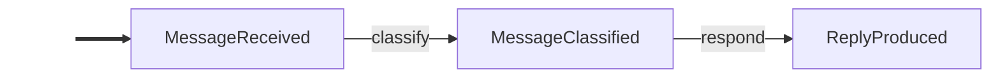

# Core Concepts

## Events

Events are frozen dataclasses that extend `Event`. Immutability guarantees a safe append-only log. Subclasses are automatically made into frozen dataclasses — no decorator needed:

```python
from langgraph_events import Event


class OrderPlaced(Event):
    order_id: str
    total: float
```

Events support **inheritance**. A handler subscribed to a parent type fires for all subtypes (`isinstance` matching). The built-in `Auditable` marker class is a common example — subscribe once with `@on(Auditable)` and every marked event is captured automatically:

```python
from langgraph_events import Auditable, on


class OrderPlaced(Auditable):
    order_id: str


class OrderShipped(Auditable):
    order_id: str


@on(Auditable)
def audit(event: Auditable) -> None:
    # Fires for OrderPlaced, OrderShipped, and any Auditable subtype
    print(event.trail())
```

## `@on(*EventTypes)`

Decorate a function with `@on(EventType)` to subscribe it. Handlers receive the matching event and optionally an `EventLog`. They return a single `Event`, `None` (side-effect only), or `Scatter`.

```python
@on(UserMessage)
def greet(event: UserMessage) -> Greeting:
    return Greeting(text=f"Hello!")
```

Handlers may also request `config: RunnableConfig` or `store: BaseStore` by type annotation (reducer channels are still injected by parameter name).

**Multi-subscription** — a single handler fires on multiple event types:

```python
@on(UserMessage, ToolResult)
def call_llm(event: Event, log: EventLog) -> AssistantMessage:
    history = log.filter(Event)
    ...
```

**Field matchers** — narrow dispatch by requiring a field to be a specific type. The matched field is injected as a typed parameter:

```python
@on(Resumed, interrupted=ApprovalRequested)
def on_approval(event: Resumed, interrupted: ApprovalRequested) -> Confirmed:
    ...  # only fires when interrupted is an ApprovalRequested
```

See [Control Flow — Field Matchers](control-flow.md#field-matchers--type-safe-resume-dispatch) for details.

## `EventGraph`

The main entry point. Pass a list of handler functions and `EventGraph` derives the topology.

```python
graph = EventGraph(
    [classify, respond, audit],
    max_rounds=50,           # default: 100; prevents infinite loops
    reducers=[my_reducer],   # optional — see Reducers page
)
```

`max_rounds` (default: 100) prevents infinite loops — the library auto-sets LangGraph's `recursion_limit` so this is the only knob you need. Exceeding the limit emits a `MaxRoundsExceeded` event (a `Halted` subclass) instead of raising, so checkpointed state stays clean and the graph can be retried.

### Visualizing the Event Flow

`graph.mermaid()` returns a Mermaid flowchart showing how events correlate through handlers. Events are nodes, handler names are edge labels, and side-effect handlers (returning `None`) are listed in a footer comment.

```python
print(graph.mermaid())
```



### LangGraph Escape Hatch

Access the underlying `CompiledStateGraph` for advanced patterns — subgraph composition, custom streaming modes, or direct state access:

```python
compiled = graph.compiled
for chunk in compiled.stream({"events": [SeedEvent(...)]}, stream_mode="updates"):
    print(chunk)
```

## `EventLog`

Immutable, ordered container returned by `invoke`/`ainvoke`. Handlers can also receive it as a second parameter.

```python
@on(DraftProduced)
def evaluate(event: DraftProduced, log: EventLog) -> CritiqueReceived | FinalDraftProduced:
    request = log.latest(WriteRequested)        # most recent event of this type
    all_drafts = log.filter(DraftProduced)      # all events matching this type
    if log.has(CritiqueReceived):               # boolean check
        ...
```

| Method               | Returns             | Description                                    |
|----------------------|---------------------|------------------------------------------------|
| `log.filter(T)`      | `list[T]`           | All events of type T                           |
| `log.latest(T)`      | `T \| None`         | Most recent event of type T                    |
| `log.first(T)`       | `T \| None`         | Earliest event of type T                       |
| `log.has(T)`         | `bool`              | Whether any event of type T exists             |
| `log.count(T)`       | `int`               | Number of events matching type T               |
| `log.select(T)`      | `EventLog`          | Filtered log (chainable)                       |
| `log.after(T)`       | `EventLog`          | Events after first occurrence of T             |
| `log.before(T)`      | `EventLog`          | Events before first occurrence of T            |
| `len(log)`           | `int`               | Total events                                   |
| `log[i]`             | `Event`             | Index access                                   |

## `Halted`

Return a `Halted` event (or subclass) from any handler to immediately stop the graph. No further handlers are dispatched. Subclass `Halted` with domain-specific fields instead of generic payloads:

```python
class ContentBlocked(Halted):
    label: str

@on(Classified)
def guard(event: Classified) -> Reply | ContentBlocked:
    if event.label == "blocked":
        return ContentBlocked(label=event.label)
    return Reply(text="OK")
```

**Built-in subtypes:**

| Subtype | Emitted when |
|---------|-------------|
| `MaxRoundsExceeded` | Graph exceeds `max_rounds` (has `rounds: int` field) |
| `Cancelled` | Async handler execution was cancelled |

## `Auditable`

Marker base class for events that should be auto-logged. Subclass it and subscribe a single `@on(Auditable)` handler to capture every marked event automatically. The built-in `trail()` method returns a compact summary of the event's fields.

```python
class TaskStarted(Auditable):
    name: str


@on(Auditable)
def log_event(event: Auditable) -> None:
    print(event.trail())
    # "[TaskStarted] name='deploy'"
```

## `MessageEvent`

Base class for events that wrap LangChain `BaseMessage` objects. Declare a `message` field (single message) or `messages` field (tuple of messages), and `as_messages()` auto-converts them. Pairs with `message_reducer()` for automatic message history accumulation.

```python
from langchain_core.messages import HumanMessage, AIMessage


class UserMessageReceived(MessageEvent, Auditable):
    message: HumanMessage


class LLMResponded(MessageEvent, Auditable):
    message: AIMessage
```

## `SystemPromptSet`

Built-in `MessageEvent` that wraps a `SystemMessage`. Makes the system prompt a first-class citizen in the event log — visible, queryable, and auditable.

```python
from langgraph_events import SystemPromptSet, message_reducer, EventGraph
from langchain_core.messages import SystemMessage

messages = message_reducer()
graph = EventGraph([call_llm, execute_tools], reducers=[messages])

# Convenience factory
log = graph.invoke([
    SystemPromptSet.from_str("You are a helpful assistant with tools."),
    UserMessageReceived(message=HumanMessage(content="What's the weather?")),
])

# Or construct explicitly
seed = SystemPromptSet(message=SystemMessage(content="You are helpful"))
```

## What's Next

- [Control Flow](control-flow.md) — `Scatter` for fan-out, `Interrupted`/`Resumed` for human-in-the-loop
- [Reducers](reducers.md) — incremental state accumulation with `Reducer`, `ScalarReducer`, and `message_reducer()`
- [Streaming](streaming.md) — real-time event streams, LLM token deltas, and custom telemetry
- [Patterns](patterns.md) — complete runnable examples
