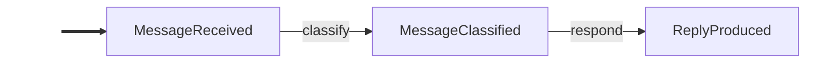

# Core Concepts

## Events

Events are frozen dataclasses that extend `Event`. Immutability guarantees a safe append-only log. Subclasses are automatically made into frozen dataclasses — no decorator needed:

```python
from langgraph_events import Event


class OrderPlaced(Event):
    order_id: str
    total: float
```

Events support **inheritance**. A handler subscribed to a parent type fires for all subtypes (`isinstance` matching). The built-in `Auditable` marker class is a common example — subscribe once with `@on(Auditable)` and every marked event is captured automatically:

```python
from langgraph_events import Auditable, on


class OrderPlaced(Auditable):
    order_id: str


class OrderShipped(Auditable):
    order_id: str


@on(Auditable)
def audit(event: Auditable) -> None:
    # Fires for OrderPlaced, OrderShipped, and any Auditable subtype
    print(event.trail())
```

## `@on(*EventTypes)`

Decorate a function with `@on(EventType)` to subscribe it. Handlers receive the matching event and optionally an `EventLog`. They return a single `Event`, `None` (side-effect only), or `Scatter`.

```python
@on(UserMessage)
def greet(event: UserMessage) -> Greeting:
    return Greeting(text=f"Hello!")
```

Handlers may also request `config: RunnableConfig` or `store: BaseStore` by type annotation (reducer channels are still injected by parameter name).

**Multi-subscription** — a single handler fires on multiple event types:

```python
@on(UserMessage, ToolResult)
def call_llm(event: Event, log: EventLog) -> AssistantMessage:
    history = log.filter(Event)
    ...
```

## `EventGraph`

The main entry point. Pass a list of handler functions and `EventGraph` derives the topology.

```python
graph = EventGraph(
    [classify, respond, audit],
    max_rounds=50,           # default: 100; prevents infinite loops
    reducers=[my_reducer],   # optional — see Reducer section
)
```

`max_rounds` (default: 100) prevents infinite loops — the library auto-sets LangGraph's `recursion_limit` so this is the only knob you need. Override via `invoke(seed, recursion_limit=N)` if needed.

### Visualizing the Event Flow

`graph.mermaid()` returns a Mermaid flowchart showing how events correlate through handlers. Events are nodes, handler names are edge labels, and side-effect handlers (returning `None`) are listed in a footer comment.

```python
print(graph.mermaid())
```



### LangGraph Escape Hatch

Access the underlying `CompiledStateGraph` for advanced patterns — subgraph composition, custom streaming modes, or direct state access:

```python
compiled = graph.compiled
for chunk in compiled.stream({"events": [SeedEvent(...)]}, stream_mode="updates"):
    print(chunk)
```

## `EventLog`

Immutable, ordered container returned by `invoke`/`ainvoke`. Handlers can also receive it as a second parameter.

```python
@on(DraftProduced)
def evaluate(event: DraftProduced, log: EventLog) -> CritiqueReceived | FinalDraftProduced:
    request = log.latest(WriteRequested)        # most recent event of this type
    all_drafts = log.filter(DraftProduced)      # all events matching this type
    if log.has(CritiqueReceived):               # boolean check
        ...
```

| Method               | Returns             | Description                                    |
|----------------------|---------------------|------------------------------------------------|
| `log.filter(T)`      | `list[T]`           | All events of type T                           |
| `log.latest(T)`      | `T \| None`         | Most recent event of type T                    |
| `log.first(T)`       | `T \| None`         | Earliest event of type T                       |
| `log.has(T)`         | `bool`              | Whether any event of type T exists             |
| `log.count(T)`       | `int`               | Number of events matching type T               |
| `log.select(T)`      | `EventLog`          | Filtered log (chainable)                       |
| `log.after(T)`       | `EventLog`          | Events after first occurrence of T             |
| `log.before(T)`      | `EventLog`          | Events before first occurrence of T            |
| `len(log)`           | `int`               | Total events                                   |
| `log[i]`             | `Event`             | Index access                                   |

## `Halted`

Return a `Halted` event from any handler to immediately stop the graph. No further handlers are dispatched.

```python
@on(Classified)
def guard(event: Classified) -> Reply | Halted:
    if event.label == "blocked":
        return Halted(reason="Content policy violation")
    return Reply(text="OK")
```

## `Scatter`

Return `Scatter([event1, event2, ...])` to fan-out into multiple events. Each becomes a separate pending event, dispatched in the next round. Use `Scatter[WorkItem]` to annotate the produced type — this renders as a dashed edge in `mermaid()` diagrams.

```python
@on(Batch)
def split(event: Batch) -> Scatter[WorkItem]:
    return Scatter([WorkItem(item=i) for i in event.items])


@on(WorkItem)
def process(event: WorkItem) -> WorkDone:
    return WorkDone(result=f"done:{event.item}")


@on(WorkDone)
def gather(event: WorkDone, log: EventLog) -> BatchResult | None:
    all_done = log.filter(WorkDone)
    batch = log.latest(Batch)
    if len(all_done) >= len(batch.items):
        return BatchResult(results=tuple(e.result for e in all_done))
    return None  # not all items done yet
```

## `Auditable`

Marker base class for events that should be auto-logged. Subclass it and subscribe a single `@on(Auditable)` handler to capture every marked event automatically. The built-in `trail()` method returns a compact summary of the event's fields.

```python
class TaskStarted(Auditable):
    name: str


@on(Auditable)
def log_event(event: Auditable) -> None:
    print(event.trail())
    # "[TaskStarted] name='deploy'"
```

## `MessageEvent`

Base class for events that wrap LangChain `BaseMessage` objects. Declare a `message` field (single message) or `messages` field (tuple of messages), and `as_messages()` auto-converts them. Pairs with `message_reducer()` for automatic message history accumulation.

```python
from langchain_core.messages import HumanMessage, AIMessage


class UserMessageReceived(MessageEvent, Auditable):
    message: HumanMessage


class LLMResponded(MessageEvent, Auditable):
    message: AIMessage
```

## `SystemPromptSet`

Built-in `MessageEvent` that wraps a `SystemMessage`. Makes the system prompt a first-class citizen in the event log — visible, queryable, and auditable.

```python
from langgraph_events import SystemPromptSet, message_reducer, EventGraph
from langchain_core.messages import SystemMessage

messages = message_reducer()
graph = EventGraph([call_llm, execute_tools], reducers=[messages])

# Convenience factory
log = graph.invoke([
    SystemPromptSet.from_str("You are a helpful assistant with tools."),
    UserMessageReceived(message=HumanMessage(content="What's the weather?")),
])

# Or construct explicitly
seed = SystemPromptSet(message=SystemMessage(content="You are helpful"))
```

## Reducers

**When to use reducers:** Pure event-driven handlers (`log.filter()`, `log.latest()`) are the default and work for most patterns. Add a `Reducer` when you need incremental accumulation that would be expensive to recompute from the full log each round — the canonical case is `message_reducer()` for LLM conversation history. Add a `ScalarReducer` for last-write-wins configuration values injected directly into handlers. If you find yourself calling `log.filter(X)` and transforming the result the same way in multiple handlers, that's a signal a reducer would help.

A `Reducer` maps events to contributions for a named LangGraph state channel. The framework maintains the channel incrementally — handlers receive the accumulated value by declaring a parameter whose name matches the reducer.

```python
from langgraph_events import Reducer, ScalarReducer, message_reducer, EventGraph, on

# --- Reducer: accumulates contributions from matching events ---
history = Reducer("history", event_type=UserMsg, fn=lambda e: [e.text], default=[])


@on(UserMsg)
def respond(event: UserMsg, history: list) -> Reply:
    # history contains all projected values so far
    ...


graph = EventGraph([respond], reducers=[history])

# --- message_reducer: built-in for LangChain message accumulation ---
messages = message_reducer()
graph = EventGraph([call_llm, handle_tools], reducers=[messages])
log = graph.invoke([
    SystemPromptSet.from_str("You are a helpful assistant."),
    UserMessageReceived(message=HumanMessage(content="Hi")),
])

# Alternative: explicit default list
messages = message_reducer([SystemMessage(content="You are a helpful assistant.")])

# --- ScalarReducer: last-write-wins, injected as a bare value ---
temperature = ScalarReducer(
    "temperature", event_type=TempSet, fn=lambda e: e.value, default=0.7
)
```

The parameter name `messages` matches the reducer name, so the framework injects the accumulated message list automatically:

```python
@on(UserMessageReceived, ToolsExecuted)
async def call_llm(event: Event, messages: list[BaseMessage]) -> LLMResponded:
    response = await llm.ainvoke(messages)
    ...
```

### `SKIP`

When a `ScalarReducer` function returns `SKIP`, the reducer value is left unchanged. This lets handlers opt out of updating the reducer for certain events.

```python
from langgraph_events import SKIP, ScalarReducer

temperature = ScalarReducer(
    "temperature", event_type=ConfigUpdated, fn=lambda e: e.temp if e.temp is not None else SKIP, default=0.7
)
```

## `Interrupted` / `Resumed`

`Interrupted` is a bare marker class — subclass it with domain-specific fields to pause the graph and wait for human input. Resume with `graph.resume(event)` — the event is auto-dispatched (handlers subscribed to its type fire), then the framework creates a `Resumed` event alongside it. `resume()` requires an `Event` instance; passing a plain string or dict raises `TypeError`.

Requires a **checkpointer** (e.g., `MemorySaver`).

```python
from langgraph.checkpoint.memory import MemorySaver


class OrderConfirmationRequested(Interrupted):
    order_id: str
    total: float


class ApprovalSubmitted(Event):
    approved: bool


@on(OrderPlaced)
def confirm(event: OrderPlaced) -> OrderConfirmationRequested:
    return OrderConfirmationRequested(order_id=event.order_id, total=event.total)


@on(ApprovalSubmitted)
def handle_approval(event: ApprovalSubmitted, log: EventLog) -> OrderConfirmed | OrderCancelled:
    confirm_event = log.latest(OrderConfirmationRequested)
    if event.approved:
        return OrderConfirmed(order_id=confirm_event.order_id)
    return OrderCancelled(reason="User declined")


graph = EventGraph([confirm, handle_approval], checkpointer=MemorySaver())
config = {"configurable": {"thread_id": "order-1"}}

# First call — pauses at the interrupt
graph.invoke(OrderPlaced(order_id="A1", total=99.99), config=config)

# Check state and resume with a typed event
state = graph.get_state(config)
if state.is_interrupted:
    confirm_event = state.interrupted
    print(f"Approve order {confirm_event.order_id} for ${confirm_event.total}?")
log = graph.resume(ApprovalSubmitted(approved=True), config=config)
```

## Streaming

All `invoke`/`stream` methods have async counterparts: `ainvoke()`, `astream_events()`, `aresume()`, `astream_resume()`.

```python
# Async stream with real-time LLM token deltas and passthrough custom frames
from langgraph_events import (
    CustomEventFrame,
    LLMStreamEnd,
    LLMToken,
    StateSnapshotFrame,
    emit_state_snapshot,
    emit_custom,
)


@on(SeedEvent)
def step(event: SeedEvent) -> ReplyProduced:
    emit_state_snapshot({"messages": [], "step": "draft"})
    emit_custom("tool.progress", {"pct": 50})
    return ReplyProduced(...)


async for item in graph.astream_events(
    SeedEvent(...),
    include_llm_tokens=True,
    include_custom_events=True,
):
    if isinstance(item, LLMToken):
        print(item.content, end="")
    elif isinstance(item, LLMStreamEnd):
        print("\n[done]", item.message_id)
    elif isinstance(item, StateSnapshotFrame):
        print("snapshot:", item.data)
    elif isinstance(item, CustomEventFrame):
        print("custom:", item.name, item.data)
    else:
        print(item)
```

Use `include_llm_tokens=True` for LLM token frames and `include_custom_events=True` for `CustomEventFrame` passthrough. Use `emit_state_snapshot(data)` / `await aemit_state_snapshot(data)` for typed snapshot frames, and `emit_custom(name, data)` / `await aemit_custom(name, data)` for all other stream-only telemetry without importing LangGraph callback APIs directly.
