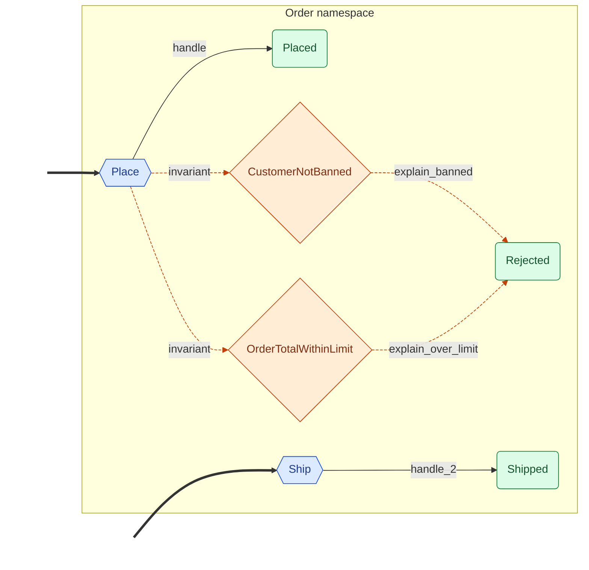

# langgraph-events

Opinionated event-driven abstraction for LangGraph with a **DDD-aligned event taxonomy**. State IS events.

!!! warning "Experimental (v0.8.0)"
    This is an early-stage personal project, not a supported product. The API will change without notice or migration path. Do not depend on this for anything you can't easily rewrite.

## What is this?

LangGraph gives you full control over agent topology, but wiring `StateGraph` nodes and conditional edges by hand is tedious. `langgraph-events` replaces that boilerplate with a reactive model: model your domain as **domains with commands and outcomes**, colocate the handler on the command, and let `EventGraph` derive the topology.

```python
class Order(Namespace):
    class Place(Command):
        customer_id: str

        class Placed(DomainEvent):
            order_id: str

        def handle(self) -> Placed:
            return Order.Place.Placed(order_id=f"o-{self.customer_id}")


graph = EventGraph([Order.Place])
log = graph.invoke(Order.Place(customer_id="alice"))
```

### What the graph looks like

`graph.namespaces().mermaid()` on the canonical [`order`](patterns.md#order) example:

<!-- autogen:start:hero -->

<!-- autogen:end -->

## Install

```bash
pip install langgraph-events           # core
pip install "langgraph-events[agui]"   # + AG-UI adapter
```

Requires Python 3.10+.

## Navigate

- **Start:** [Getting Started](getting-started.md) → [Core Concepts](concepts.md)
- **Dispatch patterns:** [Control Flow](control-flow.md) — fan-out, HITL, exceptions, invariants
- **State:** [Reducers](reducers.md) — domain-scoped or graph-wide
- **Streams:** [Streaming](streaming.md), [AG-UI Adapter](agui.md)
- **Reference:** [API](api.md), [Patterns](patterns.md)
- **Edge cases:** [Checkpointer Evolution](checkpointer-evolution.md)
