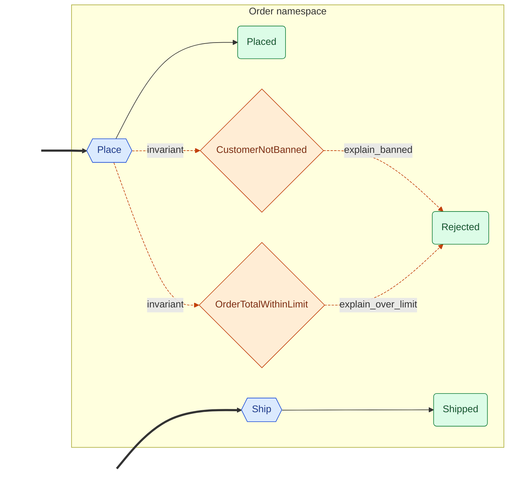

# langgraph-events

Opinionated event-driven abstraction for LangGraph with a **DDD-aligned event taxonomy**. State IS events.

!!! warning "Experimental (v0.28.0)"
    This is an early-stage personal project, not a supported product. The API will change without notice or migration path. Do not depend on this for anything you can't easily rewrite.

## What is this?

Replace hand-wired LangGraph edges with event-driven topology: model your domain as **namespaces with commands and outcomes**, colocate the handler on the command, and let `EventGraph` derive the topology.

```python
class Order(Namespace):
    class Place(Command):
        customer_id: str

        class Placed(DomainEvent):
            order_id: str

        def handle(self) -> Placed:
            return Order.Place.Placed(order_id=f"o-{self.customer_id}")


graph = EventGraph([Order.Place])
log = graph.invoke(Order.Place(customer_id="alice"))
```

### What the graph looks like

`graph.namespaces().mermaid()` on the [`order`](patterns.md#order) example:

<!-- autogen:start:hero -->

```mermaid
graph LR
    classDef entry fill:none,stroke:none,color:none
    classDef cmd fill:#dbeafe,stroke:#1d4ed8,color:#1e3a8a
    classDef devt fill:#dcfce7,stroke:#15803d,color:#14532d
    classDef intg fill:#ede9fe,stroke:#6d28d9,color:#4c1d95
    classDef syst fill:#fef3c7,stroke:#b45309,color:#78350f
    classDef halt fill:#fef3c7,stroke:#b45309,color:#78350f,stroke-width:3px,stroke-dasharray:4 2
    classDef inv fill:#ffedd5,stroke:#c2410c,color:#7c2d12
    subgraph Order["Order namespace"]
        direction LR
        Place{{Place}}:::cmd
        Placed(Placed):::devt
        Rejected(Rejected):::devt
        Ship{{Ship}}:::cmd
        Shipped(Shipped):::devt
        CustomerNotBanned{CustomerNotBanned}:::inv
        OrderTotalWithinLimit{OrderTotalWithinLimit}:::inv
    end
    _e0_[ ]:::entry ==> Place
    _e1_[ ]:::entry ==> Ship
    Place --> Placed
    Ship --> Shipped
    CustomerNotBanned -.->|explain_banned| Rejected
    OrderTotalWithinLimit -.->|explain_over_limit| Rejected
    Place -.->|invariant| CustomerNotBanned
    Place -.->|invariant| OrderTotalWithinLimit
    linkStyle 4,5,6,7 stroke:#c2410c,stroke-dasharray:4 2
```
<!-- autogen:end -->

## Install

```bash
pip install langgraph-events           # core
pip install "langgraph-events[agui]"   # + AG-UI adapter
```

Requires Python 3.11+.

## Navigate

- **Start:** [Getting Started](getting-started.md) → [Core Concepts](concepts.md)
- **Dispatch patterns:** [Control Flow](control-flow.md) — fan-out, HITL, exceptions, retries, invariants
- **State:** [Reducers](reducers.md) — domain-scoped or graph-wide
- **Agents over the log:** [Reflection](reflection.md) — `graph.reflect(log)` + the `query_log` tool: an LLM queries the run's facts lazily instead of holding the log in context
- **Streams:** [Streaming](streaming.md), [AG-UI Adapter](agui.md)
- **Reference:** [API](api.md), [Patterns](patterns.md)
- **Evolving a deployed graph:** [Checkpointer Evolution](checkpointer-evolution.md) (what's safe to change) → [Event Migrations](event-migrations.md) (keep old checkpoints working after a rename)
