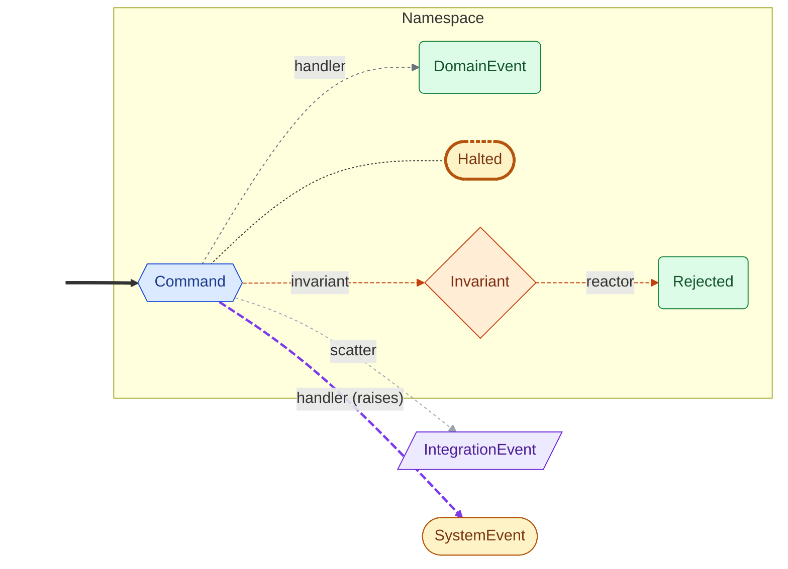

# Patterns

Runnable examples in `examples/`. Diagrams are auto-generated from each example's `graph.namespaces()` via `scripts/generate_mermaid.py` — always in sync with the code.

| If you need…                          | See                                       | Related docs                                                          |
| ------------------------------------- | ----------------------------------------- | --------------------------------------------------------------------- |
| Invariants + pinned reactions         | [Order](#order)                       | [control-flow](control-flow.md#invariants)                            |
| Human-in-the-loop approval            | [Expense](#expense-hitl)                  | [control-flow](control-flow.md#interrupted-resumed)                   |
| Tool-calling agent + AG-UI streaming  | [Conversation](#conversation-agui)        | [agui](agui.md), [reducers](reducers.md#message_reducer)              |
| Supervisor loop / fan-in              | [Task](#supervisor)                       | [reducers](reducers.md#reducer)                                       |
| Scatter fan-out / map-reduce          | [Batch](#scatter-fan-out)                 | [control-flow](control-flow.md#scatter)                               |
| Safety gates + live streaming         | [Content](#content-pipeline)              | [streaming](streaming.md), [concepts](concepts.md#system-events)      |
| Retries + escalation via `raises=`    | [Question](#error-recovery)               | [control-flow](control-flow.md#handler-exceptions)                    |

<!-- autogen:start:legend -->
<details markdown="1">
<summary>🗝️ Diagram vocabulary</summary>



</details>
<!-- autogen:end -->

## Invariants & reactions (Order namespace) { #order }

`Order` namespace, `Place` command, `Placed` / `Rejected` outcomes, a typed `CustomerNotBanned(Invariant)` that blocks banned customers, a pinned `@on(InvariantViolated, invariant=…)` reaction turning violations into domain rejections, and a declarative `ScalarReducer` as domain attribute tracking `current_status`.

<!-- autogen:start:order -->
=== "Diagram"

    ```mermaid
    graph LR
        classDef entry fill:none,stroke:none,color:none
        classDef cmd fill:#dbeafe,stroke:#1d4ed8,color:#1e3a8a
        classDef devt fill:#dcfce7,stroke:#15803d,color:#14532d
        classDef intg fill:#ede9fe,stroke:#6d28d9,color:#4c1d95
        classDef syst fill:#fef3c7,stroke:#b45309,color:#78350f
        classDef halt fill:#fef3c7,stroke:#b45309,color:#78350f,stroke-width:3px,stroke-dasharray:4 2
        classDef inv fill:#ffedd5,stroke:#c2410c,color:#7c2d12
        subgraph Order["Order namespace"]
            direction LR
            Place{{Place}}:::cmd
            Placed(Placed):::devt
            Rejected(Rejected):::devt
            Ship{{Ship}}:::cmd
            Shipped(Shipped):::devt
            CustomerNotBanned{CustomerNotBanned}:::inv
            OrderTotalWithinLimit{OrderTotalWithinLimit}:::inv
        end
        _e0_[ ]:::entry ==> Place
        _e1_[ ]:::entry ==> Ship
        Place -->|handle| Placed
        Ship -->|handle_2| Shipped
        CustomerNotBanned -.->|explain_banned| Rejected
        OrderTotalWithinLimit -.->|explain_over_limit| Rejected
        Place -.->|invariant| CustomerNotBanned
        Place -.->|invariant| OrderTotalWithinLimit
        linkStyle 4,5,6,7 stroke:#c2410c,stroke-dasharray:4 2
    ```

=== "Flow (text)"

    ```text
    Namespaces:
      Order
        Command: Place  (handlers: handle; invariant: CustomerNotBanned, OrderTotalWithinLimit)
          → Placed
        Command: Ship  (handlers: handle_2)
          → Shipped
        Event: Rejected
    System events:
      InvariantViolated
    Invariants:
      CustomerNotBanned  (on Place; reacted by: explain_banned)
      OrderTotalWithinLimit  (on Place; reacted by: explain_over_limit)
    Policies:
      explain_banned  (InvariantViolated → Rejected)
      explain_over_limit  (InvariantViolated → Rejected)
    Seed events:
      Place
      Ship
    ```

[Full code](https://github.com/cadance-io/langgraph-events/blob/main/examples/order.py) · [Raw diagrams on GitHub](https://github.com/cadance-io/langgraph-events/blob/main/examples/order.graph.md)
<!-- autogen:end -->

## Human-in-the-loop approval (Expense namespace) { #expense-hitl }

DDD domain combined with human-in-the-loop approval. LLM extracts expense data; policy checker auto-approves small expenses or pauses the graph with [`Interrupted`](control-flow.md#interrupted-resumed) for manager review. Resume with an `Approve` or `Reject` command.

<!-- autogen:start:expense_approval -->
=== "Diagram"

    ```mermaid
    graph LR
        classDef entry fill:none,stroke:none,color:none
        classDef cmd fill:#dbeafe,stroke:#1d4ed8,color:#1e3a8a
        classDef devt fill:#dcfce7,stroke:#15803d,color:#14532d
        classDef intg fill:#ede9fe,stroke:#6d28d9,color:#4c1d95
        classDef syst fill:#fef3c7,stroke:#b45309,color:#78350f
        classDef halt fill:#fef3c7,stroke:#b45309,color:#78350f,stroke-width:3px,stroke-dasharray:4 2
        classDef inv fill:#ffedd5,stroke:#c2410c,color:#7c2d12
        subgraph Expense["Expense namespace"]
            direction LR
            Approve{{Approve}}:::cmd
            Approved(Approved):::devt
            Invalidated(Invalidated):::devt
            Reject{{Reject}}:::cmd
            Rejected(Rejected):::devt
            Submit{{Submit}}:::cmd
            Submitted(Submitted):::devt
        end
        ApprovalRequired([ApprovalRequired]):::syst
        _e0_[ ]:::entry ==> Reject
        _e1_[ ]:::entry ==> Submit
        Submit -->|handle| Submitted
        Submit -->|handle| Invalidated
        Approve -->|handle_2| Approved
        Reject -->|handle_3| Rejected
        Submitted -->|check_policy| Approve
        Submitted -->|check_policy| ApprovalRequired
    ```

=== "Flow (text)"

    ```text
    Namespaces:
      Expense
        Command: Submit  (handlers: handle)
          → Submitted
          → Invalidated
        Command: Approve  (handlers: handle_2)
          → Approved
        Command: Reject  (handlers: handle_3)
          → Rejected
    System events:
      ApprovalRequired
    Policies:
      check_policy  (Submitted → Approve, ApprovalRequired)
    Seed events:
      Reject
      Submit
    ```

[Full code](https://github.com/cadance-io/langgraph-events/blob/main/examples/expense_approval.py) · [Raw diagrams on GitHub](https://github.com/cadance-io/langgraph-events/blob/main/examples/expense_approval.graph.md)
<!-- autogen:end -->

## Tool-calling + AG-UI (Conversation namespace) { #conversation-agui }

DDD domain wrapping a ReAct tool-calling agent, end-to-end wired to **AG-UI frontend tools** (CopilotKit `useFrontendTool`). `Conversation.Send` enforces content moderation before the LLM sees the message; tools declared by the frontend are bound to the LLM via `build_langchain_tools`; tool calls stream to the client as `ToolCallStart`/`ToolCallArgs`/`ToolCallEnd`; results return via `detect_new_tool_results` → `ToolsExecuted`, closing the ReAct loop. Combines `DomainEvent + MessageEvent` mixin with [`message_reducer()`](reducers.md#message_reducer). For the handler-initiated `FrontendToolCallRequested` pattern, see [AG-UI docs](agui.md#handler-initiated-frontend-tools).

<!-- autogen:start:conversation -->
=== "Diagram"

    ```mermaid
    graph LR
        classDef entry fill:none,stroke:none,color:none
        classDef cmd fill:#dbeafe,stroke:#1d4ed8,color:#1e3a8a
        classDef devt fill:#dcfce7,stroke:#15803d,color:#14532d
        classDef intg fill:#ede9fe,stroke:#6d28d9,color:#4c1d95
        classDef syst fill:#fef3c7,stroke:#b45309,color:#78350f
        classDef halt fill:#fef3c7,stroke:#b45309,color:#78350f,stroke-width:3px,stroke-dasharray:4 2
        classDef inv fill:#ffedd5,stroke:#c2410c,color:#7c2d12
        subgraph Conversation["Conversation namespace"]
            direction LR
            Blocked(Blocked):::devt
            Send{{Send}}:::cmd
            Sent(Sent):::devt
        end
        AnswerProduced[/AnswerProduced/]:::intg
        LLMResponded[/LLMResponded/]:::intg
        ToolsExecuted[/ToolsExecuted/]:::intg
        _e0_[ ]:::entry ==> Send
        _e1_[ ]:::entry ==> ToolsExecuted
        Send -->|handle| Sent
        Send -->|handle| Blocked
        Sent -->|call_llm| LLMResponded
        ToolsExecuted -->|call_llm| LLMResponded
        LLMResponded -->|finalize_answer| AnswerProduced
    %% Side-effect handlers: audit_trail (Auditable)
    ```

=== "Flow (text)"

    ```text
    Namespaces:
      Conversation
        Command: Send  (handlers: handle)
          → Sent
          → Blocked
    Integration events:
      ToolsExecuted
      LLMResponded
      AnswerProduced
    Policies:
      call_llm  (Sent, ToolsExecuted → LLMResponded)
      finalize_answer  (LLMResponded → AnswerProduced)
      audit_trail  (Auditable)  [side-effect]
    Seed events:
      Send
      ToolsExecuted
    ```

[Full code](https://github.com/cadance-io/langgraph-events/blob/main/examples/conversation.py) · [Raw diagrams on GitHub](https://github.com/cadance-io/langgraph-events/blob/main/examples/conversation.graph.md)
<!-- autogen:end -->

## Supervisor fan-in (Task namespace) { #supervisor }

`Task.Run` kicks off the supervisor loop; the supervisor handler dispatches sub-commands `Task.Research` / `Task.Code` or emits the terminal `Task.Finalized` fact. A custom [`Reducer`](reducers.md#reducer) accumulates context across specialist completions. Typed events replace manual subgraph wiring.

<!-- autogen:start:supervisor -->
=== "Diagram"

    ```mermaid
    graph LR
        classDef entry fill:none,stroke:none,color:none
        classDef cmd fill:#dbeafe,stroke:#1d4ed8,color:#1e3a8a
        classDef devt fill:#dcfce7,stroke:#15803d,color:#14532d
        classDef intg fill:#ede9fe,stroke:#6d28d9,color:#4c1d95
        classDef syst fill:#fef3c7,stroke:#b45309,color:#78350f
        classDef halt fill:#fef3c7,stroke:#b45309,color:#78350f,stroke-width:3px,stroke-dasharray:4 2
        classDef inv fill:#ffedd5,stroke:#c2410c,color:#7c2d12
        subgraph Task["Task namespace"]
            direction LR
            Code{{Code}}:::cmd
            Completed(Completed):::devt
            Finalized(Finalized):::devt
            Produced(Produced):::devt
            Research{{Research}}:::cmd
            Run{{Run}}:::cmd
        end
        _e0_[ ]:::entry ==> Run
        Run -->|supervisor| Research
        Run -->|supervisor| Code
        Run -->|supervisor| Finalized
        Completed -->|supervisor| Research
        Completed -->|supervisor| Code
        Completed -->|supervisor| Finalized
        Produced -->|supervisor| Research
        Produced -->|supervisor| Code
        Produced -->|supervisor| Finalized
        Research -->|handle| Completed
        Code -->|handle_2| Produced
    %% Side-effect handlers: audit_trail (Auditable)
    ```

=== "Flow (text)"

    ```text
    Namespaces:
      Task
        Command: Run  (handlers: supervisor)
        Command: Research  (handlers: handle)
          → Completed
        Command: Code  (handlers: handle_2)
          → Produced
        Event: Finalized
    Policies:
      audit_trail  (Auditable)  [side-effect]
    Seed events:
      Run
    ```

[Full code](https://github.com/cadance-io/langgraph-events/blob/main/examples/supervisor.py) · [Raw diagrams on GitHub](https://github.com/cadance-io/langgraph-events/blob/main/examples/supervisor.graph.md)
<!-- autogen:end -->

## Scatter fan-out (Batch namespace) { #scatter-fan-out }

`Batch.Summarize` fans out to per-document work via [`Scatter`](control-flow.md#scatter); a gather handler uses `EventLog.filter()` to complete when all `Batch.DocSummarized` facts arrive and emit `Batch.Summarized` (a namespace-level sibling — gather isn't `Summarize.handle()`, so the outcome can't be Command-private).

<!-- autogen:start:map_reduce -->
=== "Diagram"

    ```mermaid
    graph LR
        classDef entry fill:none,stroke:none,color:none
        classDef cmd fill:#dbeafe,stroke:#1d4ed8,color:#1e3a8a
        classDef devt fill:#dcfce7,stroke:#15803d,color:#14532d
        classDef intg fill:#ede9fe,stroke:#6d28d9,color:#4c1d95
        classDef syst fill:#fef3c7,stroke:#b45309,color:#78350f
        classDef halt fill:#fef3c7,stroke:#b45309,color:#78350f,stroke-width:3px,stroke-dasharray:4 2
        classDef inv fill:#ffedd5,stroke:#c2410c,color:#7c2d12
        subgraph Batch["Batch namespace"]
            direction LR
            DocDispatched(DocDispatched):::devt
            DocSummarized(DocSummarized):::devt
            Summarize{{Summarize}}:::cmd
            Summarized(Summarized):::devt
        end
        _e0_[ ]:::entry ==> Summarize
        Summarize -.->|split_batch| DocDispatched
        DocDispatched -->|summarize_one| DocSummarized
        DocSummarized -->|gather_summaries| Summarized
    %% Side-effect handlers: audit_trail (Auditable)
        linkStyle 1 stroke:#7c3aed,stroke-width:2.5px,stroke-dasharray:8 3
    ```

=== "Flow (text)"

    ```text
    Namespaces:
      Batch
        Command: Summarize  (handlers: split_batch; scatters Scatter[DocDispatched])
        Event: DocDispatched
        Event: DocSummarized
        Event: Summarized
    Policies:
      summarize_one  (DocDispatched → DocSummarized)
      gather_summaries  (DocSummarized → Summarized)
      audit_trail  (Auditable)  [side-effect]
    Seed events:
      Summarize
    ```

[Full code](https://github.com/cadance-io/langgraph-events/blob/main/examples/map_reduce.py) · [Raw diagrams on GitHub](https://github.com/cadance-io/langgraph-events/blob/main/examples/map_reduce.graph.md)
<!-- autogen:end -->

## Safety gates + streaming (Content namespace) { #content-pipeline }

`Content.Process` with an inline `handle` classifies text; external reactions gate approval (emitting `Content.Blocked` — a `Halted` subtype — or `Content.Approved`) and analyze. Safety gates via [`Halted`](concepts.md#system-events) and live streaming via `astream_events()`. Keyword classification — no LLM required.

<!-- autogen:start:content_pipeline -->
=== "Diagram"

    ```mermaid
    graph LR
        classDef entry fill:none,stroke:none,color:none
        classDef cmd fill:#dbeafe,stroke:#1d4ed8,color:#1e3a8a
        classDef devt fill:#dcfce7,stroke:#15803d,color:#14532d
        classDef intg fill:#ede9fe,stroke:#6d28d9,color:#4c1d95
        classDef syst fill:#fef3c7,stroke:#b45309,color:#78350f
        classDef halt fill:#fef3c7,stroke:#b45309,color:#78350f,stroke-width:3px,stroke-dasharray:4 2
        classDef inv fill:#ffedd5,stroke:#c2410c,color:#7c2d12
        subgraph Content["Content namespace"]
            direction LR
            Analyzed(Analyzed):::devt
            Approved(Approved):::devt
            Blocked([Blocked]):::halt
            Classified(Classified):::devt
            Process{{Process}}:::cmd
        end
        _e0_[ ]:::entry ==> Process
        Process -->|handle| Classified
        Classified -->|gate| Blocked
        Classified -->|gate| Approved
        Approved -->|analyze| Analyzed
    ```

=== "Flow (text)"

    ```text
    Namespaces:
      Content
        Command: Process  (handlers: handle)
          → Classified
        Event: Blocked  [Halted]
        Event: Approved
        Event: Analyzed
    Policies:
      gate  (Classified → Blocked, Approved)
      analyze  (Approved → Analyzed)
    Seed events:
      Process
    ```

[Full code](https://github.com/cadance-io/langgraph-events/blob/main/examples/content_pipeline.py) · [Raw diagrams on GitHub](https://github.com/cadance-io/langgraph-events/blob/main/examples/content_pipeline.graph.md)
<!-- autogen:end -->

## Retries & escalation (Question namespace) { #error-recovery }

Declared handler exceptions with retry + escalation via class-level `raises` on the Command and `HandlerRaised`. `Question.Ask` is the entry command — its inline `handle()` calls the LLM and may raise `RateLimitError`; a rate-limit catcher re-issues a fresh `Question.Ask` (with `attempt+1`), looping back through `Ask.handle()`. `Ask.Answered` stays Command-private, produced only by `Ask.handle()`. Chained catchers escalate to `Question.GaveUp` (a `Halted` subtype) after `MAX_ATTEMPTS`.

<!-- autogen:start:error_recovery -->
=== "Diagram"

    ```mermaid
    graph LR
        classDef entry fill:none,stroke:none,color:none
        classDef cmd fill:#dbeafe,stroke:#1d4ed8,color:#1e3a8a
        classDef devt fill:#dcfce7,stroke:#15803d,color:#14532d
        classDef intg fill:#ede9fe,stroke:#6d28d9,color:#4c1d95
        classDef syst fill:#fef3c7,stroke:#b45309,color:#78350f
        classDef halt fill:#fef3c7,stroke:#b45309,color:#78350f,stroke-width:3px,stroke-dasharray:4 2
        classDef inv fill:#ffedd5,stroke:#c2410c,color:#7c2d12
        subgraph Question["Question namespace"]
            direction LR
            Answered(Answered):::devt
            Ask{{Ask}}:::cmd
            GaveUp([GaveUp]):::halt
        end
        HandlerRaised([HandlerRaised]):::syst
        Ask -.->|"handle (raises)"| HandlerRaised
        Ask -->|handle| Answered
        HandlerRaised -.->|"backoff_and_retry (raises)"| HandlerRaised
        HandlerRaised -->|backoff_and_retry| Ask
        HandlerRaised -->|give_up| GaveUp
        linkStyle 0,2 stroke:#6b7280,stroke-dasharray:3 3
    ```

=== "Flow (text)"

    ```text
    Namespaces:
      Question
        Command: Ask  (handlers: handle; raises RateLimitError)
          → Answered
        Event: GaveUp  [Halted]
    System events:
      HandlerRaised
    Policies:
      backoff_and_retry  (HandlerRaised → Ask)  [raises QuotaExhaustedError]
      give_up  (HandlerRaised → GaveUp)
    ```

[Full code](https://github.com/cadance-io/langgraph-events/blob/main/examples/error_recovery.py) · [Raw diagrams on GitHub](https://github.com/cadance-io/langgraph-events/blob/main/examples/error_recovery.graph.md)
<!-- autogen:end -->

