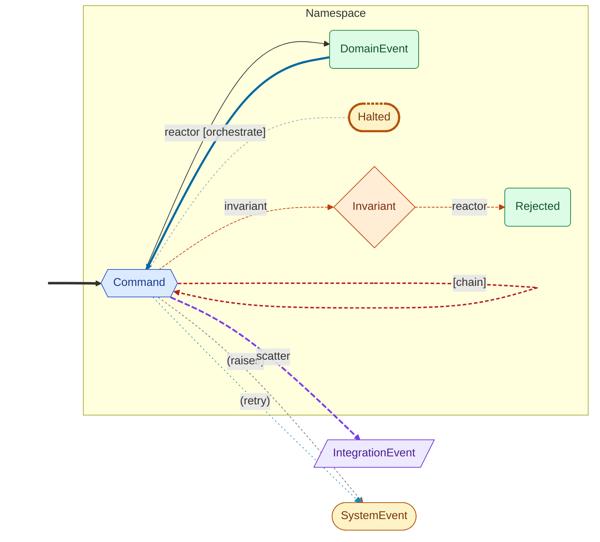

# Patterns

Runnable examples in `examples/`. Diagrams auto-generated from each example's `graph.namespaces()` (always in sync with code).

| If you need…                          | See                                       | Related docs                                                          |
| ------------------------------------- | ----------------------------------------- | --------------------------------------------------------------------- |
| Invariants + pinned reactions         | [Order](#order)                       | [control-flow](control-flow.md#invariants)                            |
| Human-in-the-loop approval            | [Expense](#expense-hitl)                  | [control-flow](control-flow.md#interrupted-resumed)                   |
| Tool-calling agent + AG-UI streaming  | [Conversation](#conversation-agui)        | [agui](agui.md), [reducers](reducers.md#message_reducer)              |
| Supervisor loop / fan-in              | [Task](#supervisor)                       | [reducers](reducers.md#reducer)                                       |
| Scatter fan-out / map-reduce          | [Batch](#scatter-fan-out)                 | [control-flow](control-flow.md#scatter)                               |
| Safety gates + live streaming         | [Content](#content-pipeline)              | [streaming](streaming.md), [concepts](concepts.md#system-events)      |
| Retries + escalation via `retry=`     | [Question](#error-recovery)               | [control-flow](control-flow.md#retries)                               |

<!-- autogen:start:legend -->
<details markdown="1">
<summary>🗝️ Diagram vocabulary</summary>


```mermaid
graph LR
    classDef entry fill:none,stroke:none,color:none
    classDef cmd fill:#dbeafe,stroke:#1d4ed8,color:#1e3a8a
    classDef devt fill:#dcfce7,stroke:#15803d,color:#14532d
    classDef intg fill:#ede9fe,stroke:#6d28d9,color:#4c1d95
    classDef syst fill:#fef3c7,stroke:#b45309,color:#78350f
    classDef halt fill:#fef3c7,stroke:#b45309,color:#78350f,stroke-width:3px,stroke-dasharray:4 2
    classDef inv fill:#ffedd5,stroke:#c2410c,color:#7c2d12
    subgraph Example["Namespace"]
      direction LR
      Command{{Command}}:::cmd
      DomainEvent(DomainEvent):::devt
      Halted([Halted]):::halt
      Invariant{Invariant}:::inv
      Rejected(Rejected):::devt
    end
    IntegrationEvent[/IntegrationEvent/]:::intg
    SystemEvent([SystemEvent]):::syst
    _seed_[ ]:::entry ==> Command
    Command --> DomainEvent
    Command -.->|"(raises)"| SystemEvent
    Command -.->|scatter| IntegrationEvent
    Command -.- Halted
    Command -.->|invariant| Invariant -.->|reactor| Rejected
    DomainEvent -->|"reactor [orchestrate]"| Command
    Command -->|"[chain]"| Command
    Command -.->|"(retry)"| SystemEvent
    linkStyle 2 stroke:#6b7280,stroke-dasharray:3 3
    linkStyle 3 stroke:#7c3aed,stroke-width:2.5px,stroke-dasharray:8 3
    linkStyle 4 stroke:#9ca3af,stroke-dasharray:3 3
    linkStyle 5,6 stroke:#c2410c,stroke-dasharray:4 2
    linkStyle 7 stroke:#0369a1,stroke-width:3px
    linkStyle 8 stroke:#b91c1c,stroke-width:2px,stroke-dasharray:5 3
    linkStyle 9 stroke:#0891b2,stroke-dasharray:2 4
```

</details>
<!-- autogen:end -->

## Invariants & reactions (Order namespace) { #order }

- Commands: `Place`, `Ship`. Outcomes: `Placed`, `Rejected`, `Shipped`.
- Invariants: `CustomerNotBanned`, `OrderTotalWithinLimit` (typed, with pinned reactors turning violations into namespace-level `Order.Rejected`).
- State: `current_status` (`ScalarReducer` as domain attribute).

<!-- autogen:start:order -->
=== "Diagram"

    ```mermaid
    graph LR
        classDef entry fill:none,stroke:none,color:none
        classDef cmd fill:#dbeafe,stroke:#1d4ed8,color:#1e3a8a
        classDef devt fill:#dcfce7,stroke:#15803d,color:#14532d
        classDef intg fill:#ede9fe,stroke:#6d28d9,color:#4c1d95
        classDef syst fill:#fef3c7,stroke:#b45309,color:#78350f
        classDef halt fill:#fef3c7,stroke:#b45309,color:#78350f,stroke-width:3px,stroke-dasharray:4 2
        classDef inv fill:#ffedd5,stroke:#c2410c,color:#7c2d12
        subgraph Order["Order namespace"]
            direction LR
            Place{{Place}}:::cmd
            Placed(Placed):::devt
            Rejected(Rejected):::devt
            Ship{{Ship}}:::cmd
            Shipped(Shipped):::devt
            CustomerNotBanned{CustomerNotBanned}:::inv
            OrderTotalWithinLimit{OrderTotalWithinLimit}:::inv
        end
        _e0_[ ]:::entry ==> Place
        _e1_[ ]:::entry ==> Ship
        Place --> Placed
        Ship --> Shipped
        CustomerNotBanned -.->|explain_banned| Rejected
        OrderTotalWithinLimit -.->|explain_over_limit| Rejected
        Place -.->|invariant| CustomerNotBanned
        Place -.->|invariant| OrderTotalWithinLimit
        linkStyle 4,5,6,7 stroke:#c2410c,stroke-dasharray:4 2
    ```

=== "Flow (text)"

    ```text
    Namespaces:
      Order
        Command: Place  (invariant: CustomerNotBanned, OrderTotalWithinLimit)
          → Placed
        Command: Ship
          → Shipped
        Event: Rejected
    System events:
      InvariantViolated
    Invariants:
      CustomerNotBanned  (on Place; reacted by: explain_banned)
      OrderTotalWithinLimit  (on Place; reacted by: explain_over_limit)
    Policies:
      explain_banned  (InvariantViolated → Rejected)
      explain_over_limit  (InvariantViolated → Rejected)
    Seed events:
      Place
      Ship
    ```

[Full code](https://github.com/cadance-io/langgraph-events/blob/main/examples/order.py) · [Raw diagrams on GitHub](https://github.com/cadance-io/langgraph-events/blob/main/examples/order.graph.md)
<!-- autogen:end -->

!!! note "Domain-named inline handlers"
    A `Command`'s inline handler can be named after its verb (`place`, `ship`, `submit`, …) instead of the generic `handle`. The framework picks up the **sole public method** in the class body; underscore-prefix helpers. Declaring more than one public method on a `Command` raises `TypeError` at class creation. See [`examples/order.py`](https://github.com/cadance-io/langgraph-events/blob/main/examples/order.py) for the canonical form.

## Human-in-the-loop approval (Expense namespace) { #expense-hitl }

- LLM extracts expense data; policy checker auto-approves small expenses or pauses with [`Interrupted`](control-flow.md#interrupted-resumed) for manager review.
- Resume with an `Approve` or `Reject` command.

<!-- autogen:start:expense_approval -->
=== "Diagram"

    ```mermaid
    graph LR
        classDef entry fill:none,stroke:none,color:none
        classDef cmd fill:#dbeafe,stroke:#1d4ed8,color:#1e3a8a
        classDef devt fill:#dcfce7,stroke:#15803d,color:#14532d
        classDef intg fill:#ede9fe,stroke:#6d28d9,color:#4c1d95
        classDef syst fill:#fef3c7,stroke:#b45309,color:#78350f
        classDef halt fill:#fef3c7,stroke:#b45309,color:#78350f,stroke-width:3px,stroke-dasharray:4 2
        classDef inv fill:#ffedd5,stroke:#c2410c,color:#7c2d12
        subgraph Expense["Expense namespace"]
            direction LR
            Approve{{Approve}}:::cmd
            Approved(Approved):::devt
            Invalidated(Invalidated):::devt
            Reject{{Reject}}:::cmd
            Rejected(Rejected):::devt
            Submit{{Submit}}:::cmd
            Submitted(Submitted):::devt
        end
        ApprovalRequired([ApprovalRequired]):::syst
        _e0_[ ]:::entry ==> Reject
        _e1_[ ]:::entry ==> Submit
        Submit --> Submitted
        Submit --> Invalidated
        Approve --> Approved
        Reject --> Rejected
        Submitted -->|"check_policy [orchestrate]"| Approve
        Submitted -->|check_policy| ApprovalRequired
        linkStyle 6 stroke:#0369a1,stroke-width:3px
    ```

=== "Flow (text)"

    ```text
    Namespaces:
      Expense
        Command: Submit
          → Submitted
          → Invalidated
        Command: Approve
          → Approved
        Command: Reject
          → Rejected
    System events:
      ApprovalRequired
    Policies:
      check_policy  (Submitted → Approve, ApprovalRequired)
    Causal notes:
      Submitted → Approve  via check_policy  [orchestrate]
    Seed events:
      Reject
      Submit
    ```

[Full code](https://github.com/cadance-io/langgraph-events/blob/main/examples/expense_approval.py) · [Raw diagrams on GitHub](https://github.com/cadance-io/langgraph-events/blob/main/examples/expense_approval.graph.md)
<!-- autogen:end -->

## Tool-calling + AG-UI (Conversation namespace) { #conversation-agui }

ReAct tool-calling agent wired end-to-end to **AG-UI frontend tools** (CopilotKit `useFrontendTool`).

- `Conversation.Send` enforces content moderation before the LLM sees the message.
- Frontend-declared tools bound to the LLM via `build_langchain_tools`.
- Tool calls stream as `ToolCallStart`/`ToolCallArgs`/`ToolCallEnd`; results return via `detect_new_tool_results` → `ToolsExecuted`.
- `DomainEvent + MessageEvent` mixin with [`message_reducer()`](reducers.md#message_reducer).
- For the handler-initiated `FrontendToolCallRequested` pattern, see [AG-UI](agui.md#handler-initiated-frontend-tools).

<!-- autogen:start:conversation -->
=== "Diagram"

    ```mermaid
    graph LR
        classDef entry fill:none,stroke:none,color:none
        classDef cmd fill:#dbeafe,stroke:#1d4ed8,color:#1e3a8a
        classDef devt fill:#dcfce7,stroke:#15803d,color:#14532d
        classDef intg fill:#ede9fe,stroke:#6d28d9,color:#4c1d95
        classDef syst fill:#fef3c7,stroke:#b45309,color:#78350f
        classDef halt fill:#fef3c7,stroke:#b45309,color:#78350f,stroke-width:3px,stroke-dasharray:4 2
        classDef inv fill:#ffedd5,stroke:#c2410c,color:#7c2d12
        subgraph Conversation["Conversation namespace"]
            direction LR
            Blocked(Blocked):::devt
            Send{{Send}}:::cmd
            Sent(Sent):::devt
        end
        AnswerProduced[/AnswerProduced/]:::intg
        LLMResponded[/LLMResponded/]:::intg
        ToolsExecuted[/ToolsExecuted/]:::intg
        _e0_[ ]:::entry ==> Send
        _e1_[ ]:::entry ==> ToolsExecuted
        Send --> Sent
        Send --> Blocked
        Sent -->|call_llm| LLMResponded
        ToolsExecuted -->|call_llm| LLMResponded
        LLMResponded -->|finalize_answer| AnswerProduced
    %% Side-effect handlers: audit_trail (Auditable)
    ```

=== "Flow (text)"

    ```text
    Namespaces:
      Conversation
        Command: Send
          → Sent
          → Blocked
    Integration events:
      ToolsExecuted
      LLMResponded
      AnswerProduced
    Policies:
      call_llm  (Sent, ToolsExecuted → LLMResponded)
      finalize_answer  (LLMResponded → AnswerProduced)
      audit_trail  (Auditable)  [side-effect]
    Seed events:
      Send
      ToolsExecuted
    ```

[Full code](https://github.com/cadance-io/langgraph-events/blob/main/examples/conversation.py) · [Raw diagrams on GitHub](https://github.com/cadance-io/langgraph-events/blob/main/examples/conversation.graph.md)
<!-- autogen:end -->

## Supervisor fan-in (Task namespace) { #supervisor }

- `Task.Run` kicks off the supervisor loop; supervisor dispatches sub-commands `Task.Research` / `Task.Code` or emits the terminal `Task.Finalized` fact.
- Custom [`Reducer`](reducers.md#reducer) folds specialist outputs into shared context.

<!-- autogen:start:supervisor -->
=== "Diagram"

    ```mermaid
    graph LR
        classDef entry fill:none,stroke:none,color:none
        classDef cmd fill:#dbeafe,stroke:#1d4ed8,color:#1e3a8a
        classDef devt fill:#dcfce7,stroke:#15803d,color:#14532d
        classDef intg fill:#ede9fe,stroke:#6d28d9,color:#4c1d95
        classDef syst fill:#fef3c7,stroke:#b45309,color:#78350f
        classDef halt fill:#fef3c7,stroke:#b45309,color:#78350f,stroke-width:3px,stroke-dasharray:4 2
        classDef inv fill:#ffedd5,stroke:#c2410c,color:#7c2d12
        subgraph Task["Task namespace"]
            direction LR
            Code{{Code}}:::cmd
            Completed(Completed):::devt
            Finalized(Finalized):::devt
            Produced(Produced):::devt
            Research{{Research}}:::cmd
            Run{{Run}}:::cmd
        end
        _e0_[ ]:::entry ==> Run
        Run -->|"supervisor [orchestrate]"| Research
        Run -->|"supervisor [orchestrate]"| Code
        Run -->|supervisor| Finalized
        Completed -->|"supervisor [orchestrate]"| Research
        Completed -->|"supervisor [orchestrate]"| Code
        Completed -->|supervisor| Finalized
        Produced -->|"supervisor [orchestrate]"| Research
        Produced -->|"supervisor [orchestrate]"| Code
        Produced -->|supervisor| Finalized
        Research --> Completed
        Code --> Produced
    %% Side-effect handlers: audit_trail (Auditable)
        linkStyle 1,2,4,5,7,8 stroke:#0369a1,stroke-width:3px
    ```

=== "Flow (text)"

    ```text
    Namespaces:
      Task
        Command: Run  (handlers: supervisor)
        Command: Research
          → Completed
        Command: Code
          → Produced
        Event: Finalized
    Policies:
      audit_trail  (Auditable)  [side-effect]
    Causal notes:
      Run → Research  via supervisor  [orchestrate]
      Run → Code  via supervisor  [orchestrate]
      Completed → Research  via supervisor  [orchestrate]
      Completed → Code  via supervisor  [orchestrate]
      Produced → Research  via supervisor  [orchestrate]
      Produced → Code  via supervisor  [orchestrate]
    Seed events:
      Run
    ```

[Full code](https://github.com/cadance-io/langgraph-events/blob/main/examples/supervisor.py) · [Raw diagrams on GitHub](https://github.com/cadance-io/langgraph-events/blob/main/examples/supervisor.graph.md)
<!-- autogen:end -->

## Scatter fan-out (Batch namespace) { #scatter-fan-out }

- `Batch.Summarize` fans out to per-document work via [`Scatter[DocDispatched]`](control-flow.md#scatter).
- Gather handler uses `EventLog.filter()` to wait for all `DocSummarized` facts, then emits `Batch.Summarized` (namespace-level sibling — gather isn't `Summarize.handle()`, so the outcome can't be Command-private).

<!-- autogen:start:map_reduce -->
=== "Diagram"

    ```mermaid
    graph LR
        classDef entry fill:none,stroke:none,color:none
        classDef cmd fill:#dbeafe,stroke:#1d4ed8,color:#1e3a8a
        classDef devt fill:#dcfce7,stroke:#15803d,color:#14532d
        classDef intg fill:#ede9fe,stroke:#6d28d9,color:#4c1d95
        classDef syst fill:#fef3c7,stroke:#b45309,color:#78350f
        classDef halt fill:#fef3c7,stroke:#b45309,color:#78350f,stroke-width:3px,stroke-dasharray:4 2
        classDef inv fill:#ffedd5,stroke:#c2410c,color:#7c2d12
        subgraph Batch["Batch namespace"]
            direction LR
            DocDispatched(DocDispatched):::devt
            DocSummarized(DocSummarized):::devt
            Summarize{{Summarize}}:::cmd
            Summarized(Summarized):::devt
        end
        _e0_[ ]:::entry ==> Summarize
        Summarize -.->|split_batch| DocDispatched
        DocDispatched -->|summarize_one| DocSummarized
        DocSummarized -->|gather_summaries| Summarized
    %% Side-effect handlers: audit_trail (Auditable)
        linkStyle 1 stroke:#7c3aed,stroke-width:2.5px,stroke-dasharray:8 3
    ```

=== "Flow (text)"

    ```text
    Namespaces:
      Batch
        Command: Summarize  (handlers: split_batch; scatters Scatter[DocDispatched])
        Event: DocDispatched
        Event: DocSummarized
        Event: Summarized
    Policies:
      summarize_one  (DocDispatched → DocSummarized)
      gather_summaries  (DocSummarized → Summarized)
      audit_trail  (Auditable)  [side-effect]
    Seed events:
      Summarize
    ```

[Full code](https://github.com/cadance-io/langgraph-events/blob/main/examples/map_reduce.py) · [Raw diagrams on GitHub](https://github.com/cadance-io/langgraph-events/blob/main/examples/map_reduce.graph.md)
<!-- autogen:end -->

## Safety gates + streaming (Content namespace) { #content-pipeline }

- Inline `Content.Process.handle` classifies text (keyword-based — no LLM).
- External reactors gate approval, emitting `Content.Blocked` ([`Halted`](concepts.md#system-events) subtype) or `Content.Approved`.
- Live streaming via `astream_events()`.

<!-- autogen:start:content_pipeline -->
=== "Diagram"

    ```mermaid
    graph LR
        classDef entry fill:none,stroke:none,color:none
        classDef cmd fill:#dbeafe,stroke:#1d4ed8,color:#1e3a8a
        classDef devt fill:#dcfce7,stroke:#15803d,color:#14532d
        classDef intg fill:#ede9fe,stroke:#6d28d9,color:#4c1d95
        classDef syst fill:#fef3c7,stroke:#b45309,color:#78350f
        classDef halt fill:#fef3c7,stroke:#b45309,color:#78350f,stroke-width:3px,stroke-dasharray:4 2
        classDef inv fill:#ffedd5,stroke:#c2410c,color:#7c2d12
        subgraph Content["Content namespace"]
            direction LR
            Analyzed(Analyzed):::devt
            Approved(Approved):::devt
            Blocked([Blocked]):::halt
            Classified(Classified):::devt
            Process{{Process}}:::cmd
        end
        _e0_[ ]:::entry ==> Process
        Process --> Classified
        Classified -->|gate| Blocked
        Classified -->|gate| Approved
        Approved -->|analyze| Analyzed
    ```

=== "Flow (text)"

    ```text
    Namespaces:
      Content
        Command: Process
          → Classified
        Event: Blocked  [Halted]
        Event: Approved
        Event: Analyzed
    Policies:
      gate  (Classified → Blocked, Approved)
      analyze  (Approved → Analyzed)
    Seed events:
      Process
    ```

[Full code](https://github.com/cadance-io/langgraph-events/blob/main/examples/content_pipeline.py) · [Raw diagrams on GitHub](https://github.com/cadance-io/langgraph-events/blob/main/examples/content_pipeline.graph.md)
<!-- autogen:end -->

## Retries & escalation (Question namespace) { #error-recovery }

- `Question.Ask` declares `raises=(RateLimitError,)`; its inline `handle()` may raise.
- `Ask` also declares `retry=RetryPolicy(...)`, so the framework re-invokes `handle()` in place with full-jitter exponential backoff — each wait is announced as a [`HandlerRetried`](control-flow.md#retries).
- Only once the budget is spent does `HandlerRaised` reach `give_up`, which escalates to `Question.GaveUp` ([`Halted`](concepts.md#system-events) subtype). The catcher counts nothing and schedules nothing.

<!-- autogen:start:error_recovery -->
=== "Diagram"

    ```mermaid
    graph LR
        classDef entry fill:none,stroke:none,color:none
        classDef cmd fill:#dbeafe,stroke:#1d4ed8,color:#1e3a8a
        classDef devt fill:#dcfce7,stroke:#15803d,color:#14532d
        classDef intg fill:#ede9fe,stroke:#6d28d9,color:#4c1d95
        classDef syst fill:#fef3c7,stroke:#b45309,color:#78350f
        classDef halt fill:#fef3c7,stroke:#b45309,color:#78350f,stroke-width:3px,stroke-dasharray:4 2
        classDef inv fill:#ffedd5,stroke:#c2410c,color:#7c2d12
        subgraph Question["Question namespace"]
            direction LR
            Answered(Answered):::devt
            Ask{{Ask}}:::cmd
            GaveUp([GaveUp]):::halt
        end
        HandlerRaised([HandlerRaised]):::syst
        HandlerRetried([HandlerRetried]):::syst
        _e0_[ ]:::entry ==> Ask
        Ask -.->|"(raises)"| HandlerRaised
        Ask -.->|"(retry)"| HandlerRetried
        Ask --> Answered
        HandlerRaised -->|give_up| GaveUp
        linkStyle 1 stroke:#6b7280,stroke-dasharray:3 3
        linkStyle 2 stroke:#0891b2,stroke-dasharray:2 4
    ```

=== "Flow (text)"

    ```text
    Namespaces:
      Question
        Command: Ask  (raises RateLimitError; retry x3)
          → Answered
        Event: GaveUp  [Halted]
    System events:
      HandlerRaised
    Policies:
      give_up  (HandlerRaised → GaveUp)
    Seed events:
      Ask
    ```

[Full code](https://github.com/cadance-io/langgraph-events/blob/main/examples/error_recovery.py) · [Raw diagrams on GitHub](https://github.com/cadance-io/langgraph-events/blob/main/examples/error_recovery.graph.md)
<!-- autogen:end -->

