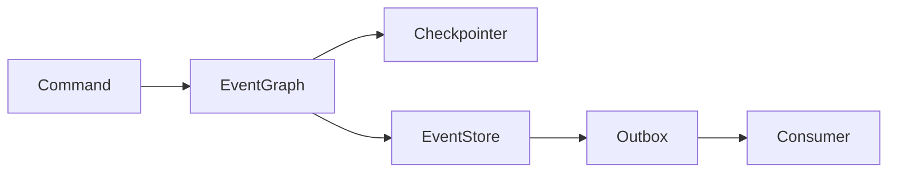

# Python Event Sourcery integration

> POC proposal, 2026-09-04. This document supports a team decision. It does not claim production readiness.

## Executive summary

This POC evaluates Python Event Sourcery as the persistence and integration layer for `langgraph-events`.

LangGraph remains responsible for workflow execution and checkpoint recovery. Python Event Sourcery stores durable business events and supports external publication.

The POC proves that both projects can use one typed event model.

## Problem

`langgraph-events` keeps event history inside the LangGraph execution state. This design supports workflow execution and checkpoint recovery.

External systems need different capabilities:

- durable business event streams,
- reliable integration event publication,
- independent event consumers,
- audit and operational analysis,
- optimistic concurrency,
- event-based projections.

Implementing these features inside `langgraph-events` would duplicate existing event infrastructure.

## Proposal

Integrate `langgraph-events` with [Python Event Sourcery](https://github.com/python-event-sourcery/python-event-sourcery).



Each component keeps one responsibility:

- The LangGraph checkpointer stores workflow execution state.
- The Python Event Sourcery `EventStore` stores durable business history.
- The Python Event Sourcery outbox publishes integration events.
- `EventGraph` connects execution with both persistence layers.

The `EventStore` is currently a durable mirror. The graph does not rebuild its execution state from this store.

## Benefits

### One event model

Every `langgraph-events` event is also a Python Event Sourcery event.

Teams do not need separate domain, persistence, and integration event classes. This removes mapping code and reduces schema differences.

### Pydantic validation

Events use frozen Pydantic models.

This provides:

- runtime field validation,
- standard serialization APIs,
- field aliases,
- JSON-compatible schemas,
- immutable event data,
- generated constructors visible to static type checkers.

### Durable business history

`EventGraph(event_store=...)` stores completed graph events in a Python Event Sourcery stream.

The stream uses the LangGraph `thread_id` as its identity. Applications can read the business history without reading the checkpoint format.

```python
log = EventLog.from_store(
    event_store,
    StreamId(name=thread_id),
)
```

This history can support audit, debugging, reporting, projections, and offline processing.

### Outbox publication

`EventGraph(outbox=...)` stores only `IntegrationEvent` instances in the configured outbox stream.

Domain events remain inside their bounded context. External consumers receive an explicit integration contract.

Handlers do not need broker-specific publication code.

### Optimistic concurrency

The integration uses the expected stream version for each append.

A divergent stream causes an error. The graph does not infer a delta from conflicting histories.

### Recoverable persistence

The checkpoint and EventStore cannot share one database transaction.

A process can stop after the checkpoint commit and before the EventStore append. The POC provides explicit recovery:

```python
graph.flush_persistence(config)
```

This method reloads checkpoint history and appends only missing events. Repeated calls do not duplicate an existing suffix.

### Preserved payload types

Nested events retain their concrete type after an EventStore round trip.

The same support covers `Resumed`, `HandlerRaised`, `HandlerRetried`, and `InvariantViolated` payloads.

Exceptions retain their class, arguments, and custom attributes. Invariant markers retain their concrete class.

### Existing event infrastructure

Python Event Sourcery already provides EventStore abstractions, PostgreSQL support, an outbox, metadata, and optimistic concurrency.

The integration avoids a second persistence framework inside `langgraph-events`.

## POC evidence

The implementation proves these behaviors:

1. `Event` can use the Python Event Sourcery base class.
2. Existing graph execution still works.
3. Completed runs can be stored in an `EventStore`.
4. Integration events can be published through an outbox.
5. Stored streams can be loaded as an `EventLog`.
6. Nested event types survive serialization.
7. Exceptions and invariant markers survive serialization.
8. Pydantic field aliases work with both serializers.
9. Failed outbox appends can be recovered without duplication.
10. The complete test, lint, and type-check suites pass.

## Product value

This integration creates a path from workflow execution to an event-driven system.

`langgraph-events` can manage orchestration. Other services can consume stable integration events through Python Event Sourcery.

The stored history can support:

- business audit,
- asynchronous projections,
- analytics pipelines,
- incident investigation,
- customer support tools,
- replay-based processing,
- integration testing.

The value increases when several applications use Python Event Sourcery.

## Non-goals

This POC does not replace the LangGraph checkpointer.

This POC does not rebuild graph execution from the Python Event Sourcery stream.

This POC does not provide exactly-once delivery across the checkpoint and EventStore transaction boundary.

This POC does not complete production operations or performance work.

## Current limitations

### Async persistence

Python Event Sourcery does not yet provide the required async API.

Current async graph methods would perform synchronous persistence operations. Production async support requires an upstream Python Event Sourcery API.

### Transaction boundary

LangGraph checkpoints and Python Event Sourcery writes use separate transactions.

`flush_persistence()` provides recovery, but it does not provide one atomic commit. The current guarantee is recoverable at-least-once publication.

### Event schema evolution

`NamespaceAwareSerde` manages checkpoint migrations.

Long-lived Python Event Sourcery streams need a separate schema evolution strategy. Class renames and payload changes require a defined compatibility contract.

### Long stream performance

The POC reads the current stream prefix before each cumulative append.

This approach validates correctness, but its cost grows with the stream. Production use needs a stored position or hash strategy.

### Required dependency

Python Event Sourcery becomes a required dependency because both projects share the same `Event` base class.

The package currently declares Pydantic, `psycopg2-binary`, and `more-itertools` as required dependencies. The team must accept this dependency scope.

### Upstream maturity

Python Event Sourcery is active, but its package metadata describes it as under heavy development.

The team must define ownership and compatibility expectations before production adoption.

## Decision requested

The team must answer these questions:

1. Do we need durable business event streams outside LangGraph checkpoints?
2. Do we need outbox publication for external consumers?
3. Should Python Event Sourcery become shared event infrastructure?
4. Do we accept a shared event base class and required dependency?
5. Who owns async support and EventStore schema evolution?

Continue the integration if the first three answers are yes.

Do not adopt Python Event Sourcery only to improve LangGraph checkpoint persistence. The checkpointer already owns workflow recovery.

## Recommended next phase

If the team accepts the direction:

1. Add the required async API to Python Event Sourcery.
2. Define stable event names and EventStore migration rules.
3. Replace full-prefix reads with a persistent position strategy.
4. Define startup recovery for every active thread.
5. Test the selected production backend under concurrency and failure.
6. Document the migration from dataclass events to Pydantic events.

The POC is sufficient for a design decision. These items are required before production adoption.
