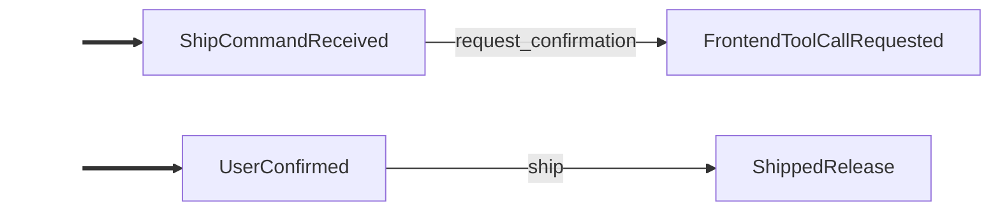

<!-- Auto-generated by scripts/generate_mermaid.py — do not edit -->
# Agui Confirm Dialog — Event Flow

```mermaid
graph LR
    classDef entry fill:none,stroke:none,color:none
    _e0_[ ]:::entry ==> ShipCommandReceived
    _e1_[ ]:::entry ==> UserConfirmed
    ShipCommandReceived -->|request_confirmation| FrontendToolCallRequested
    UserConfirmed -->|ship| ShippedRelease
%% Side-effect handlers: audit_trail (Auditable)
```
