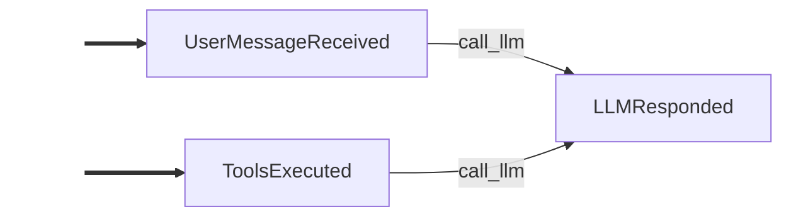

<!-- Auto-generated by scripts/generate_mermaid.py — do not edit -->
# Agui Frontend Tools — Event Flow

```mermaid
graph LR
    classDef entry fill:none,stroke:none,color:none
    _e0_[ ]:::entry ==> ToolsExecuted
    _e1_[ ]:::entry ==> UserMessageReceived
    UserMessageReceived -->|call_llm| LLMResponded
    ToolsExecuted -->|call_llm| LLMResponded
%% Side-effect handlers: audit_trail (Auditable)
```
