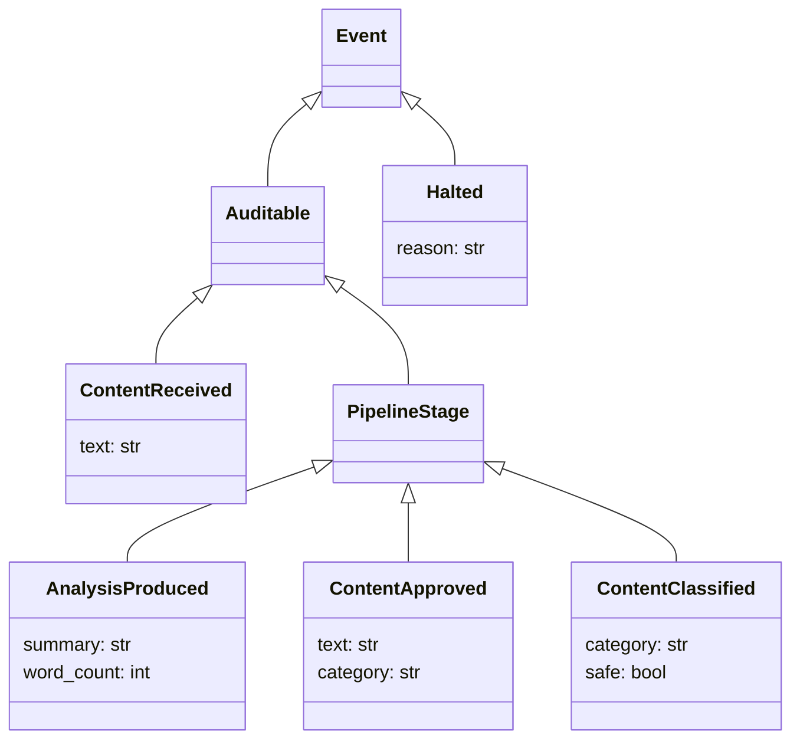

<!-- Auto-generated by scripts/generate_mermaid.py — do not edit -->
# Content Pipeline — Type Hierarchy

```mermaid
classDiagram
    class AnalysisProduced {
        summary: str
        word_count: int
    }
    class Auditable
    class ContentApproved {
        text: str
        category: str
    }
    class ContentClassified {
        category: str
        safe: bool
    }
    class ContentReceived {
        text: str
    }
    class Event
    class Halted {
        reason: str
    }
    class PipelineStage
    Auditable <|-- ContentReceived
    Auditable <|-- PipelineStage
    Event <|-- Auditable
    Event <|-- Halted
    PipelineStage <|-- AnalysisProduced
    PipelineStage <|-- ContentApproved
    PipelineStage <|-- ContentClassified
```
