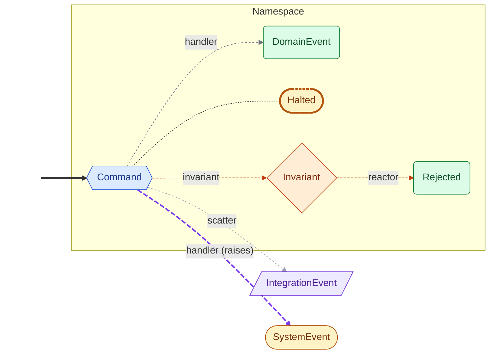
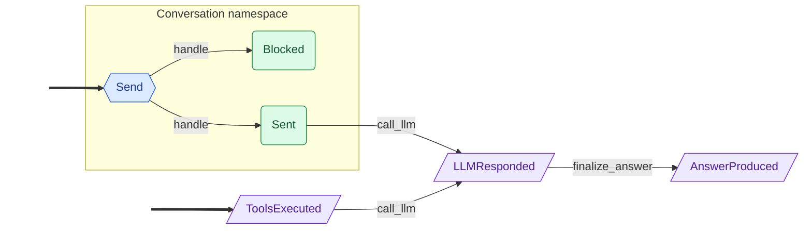

<!-- Auto-generated by scripts/generate_mermaid.py — do not edit -->
# Conversation

<details markdown="1">
<summary>🗝️ Diagram vocabulary</summary>



</details>

## Diagram

Event flow via command handlers and policies, with dashed ownership arrows filling in declared outcomes that no handler produces directly.



## Choreography (text)

```text
Namespaces:
  Conversation
    Command: Send  (handlers: handle)
      → Sent
      → Blocked
Integration events:
  ToolsExecuted
  LLMResponded
  AnswerProduced
Policies:
  call_llm  (Sent, ToolsExecuted → LLMResponded)
  finalize_answer  (LLMResponded → AnswerProduced)
  audit_trail  (Auditable)  [side-effect]
Seed events:
  Send
  ToolsExecuted
```
