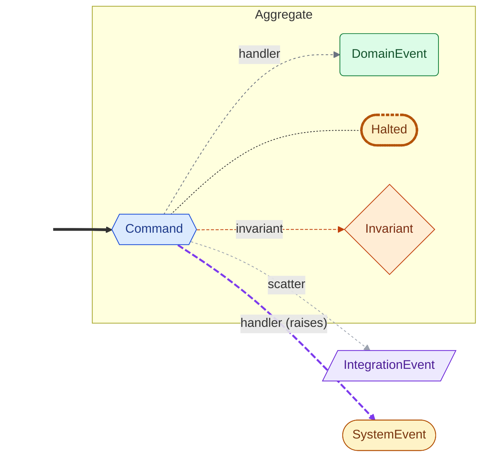
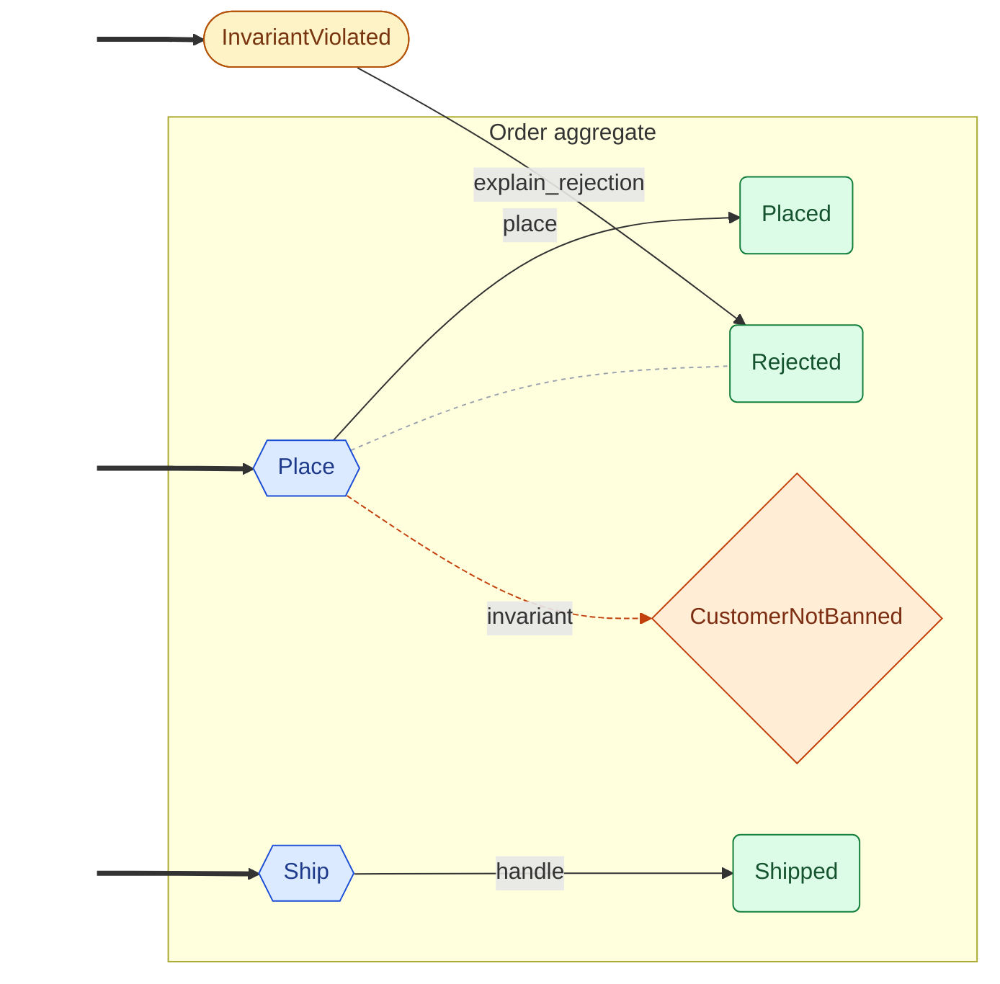

<!-- Auto-generated by scripts/generate_mermaid.py — do not edit -->
# Ddd Order

<details markdown="1">
<summary>🗝️ Diagram vocabulary</summary>



</details>

## Diagram

Event flow via command handlers and policies, with dashed ownership arrows filling in declared outcomes that no handler produces directly.



## Choreography (text)

```text
Aggregates:
  Order
    Command: Ship  (handlers: handle)
      → Shipped
    Command: Place  (handlers: place; invariant: CustomerNotBanned)
      → Placed
      → Rejected
System events:
  InvariantViolated
Invariants:
  CustomerNotBanned  (on Place; reacted by: explain_rejection)
Policies:
  explain_rejection  (InvariantViolated → Rejected)
Seed events:
  InvariantViolated
  Place
  Ship
```
