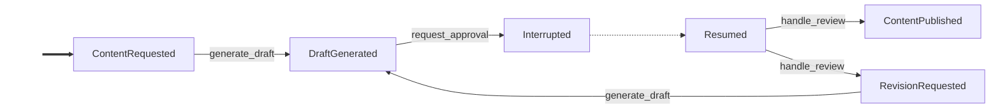
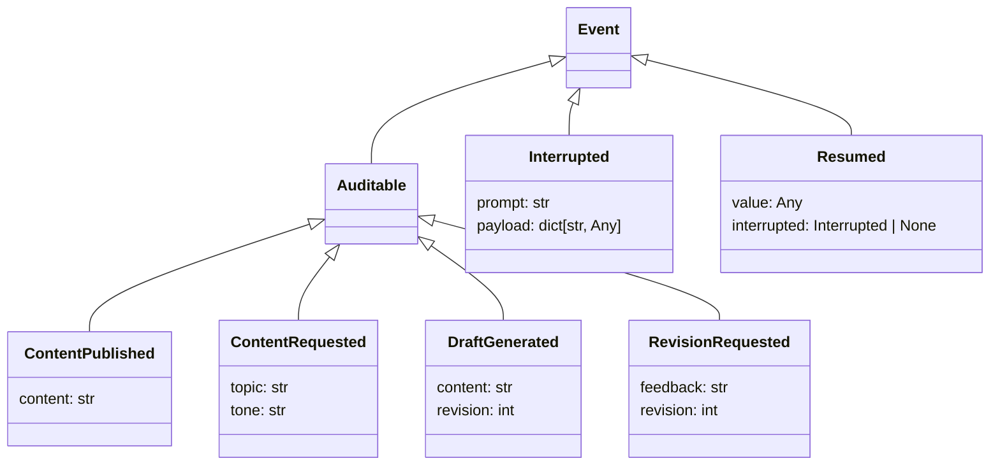

<!-- Auto-generated by scripts/generate_mermaid.py — do not edit -->
# Human In The Loop — Event Flow

```mermaid
graph LR
    classDef entry fill:none,stroke:none,color:none
    _e0_[ ]:::entry ==> ContentRequested
    ContentRequested -->|generate_draft| DraftGenerated
    RevisionRequested -->|generate_draft| DraftGenerated
    DraftGenerated -->|request_approval| Interrupted
    Resumed -->|handle_review| ContentPublished
    Resumed -->|handle_review| RevisionRequested
    Interrupted -.-> Resumed
%% Side-effect handlers: audit_trail (Auditable)
```

## Type Hierarchy

```mermaid
classDiagram
    class Auditable
    class ContentPublished {
        content: str
    }
    class ContentRequested {
        topic: str
        tone: str
    }
    class DraftGenerated {
        content: str
        revision: int
    }
    class Event
    class Interrupted {
        prompt: str
        payload: dict[str, Any]
    }
    class Resumed {
        value: Any
        interrupted: Interrupted | None
    }
    class RevisionRequested {
        feedback: str
        revision: int
    }
    Auditable <|-- ContentPublished
    Auditable <|-- ContentRequested
    Auditable <|-- DraftGenerated
    Auditable <|-- RevisionRequested
    Event <|-- Auditable
    Event <|-- Interrupted
    Event <|-- Resumed
```
