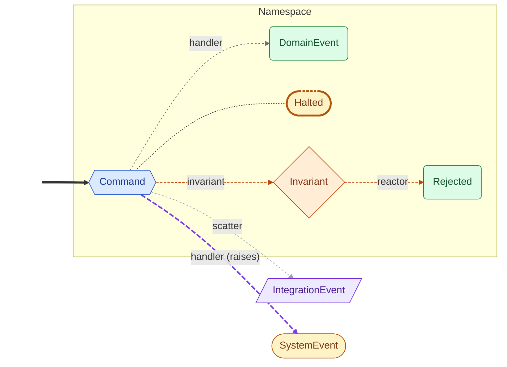
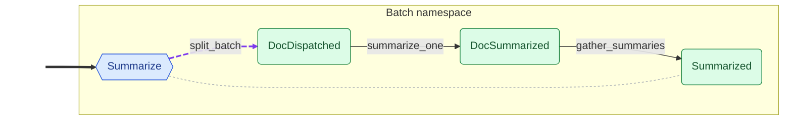

<!-- Auto-generated by scripts/generate_mermaid.py — do not edit -->
# Map Reduce

<details markdown="1">
<summary>🗝️ Diagram vocabulary</summary>



</details>

## Diagram

Event flow via command handlers and policies, with dashed ownership arrows filling in declared outcomes that no handler produces directly.



## Choreography (text)

```text
Namespaces:
  Batch
    Command: Summarize  (handlers: split_batch; scatters Scatter[DocDispatched])
      → Summarized
    Event: DocDispatched
    Event: DocSummarized
Policies:
  summarize_one  (DocDispatched → DocSummarized)
  gather_summaries  (DocSummarized → Summarized)
  audit_trail  (Auditable)  [side-effect]
Seed events:
  Summarize
```
