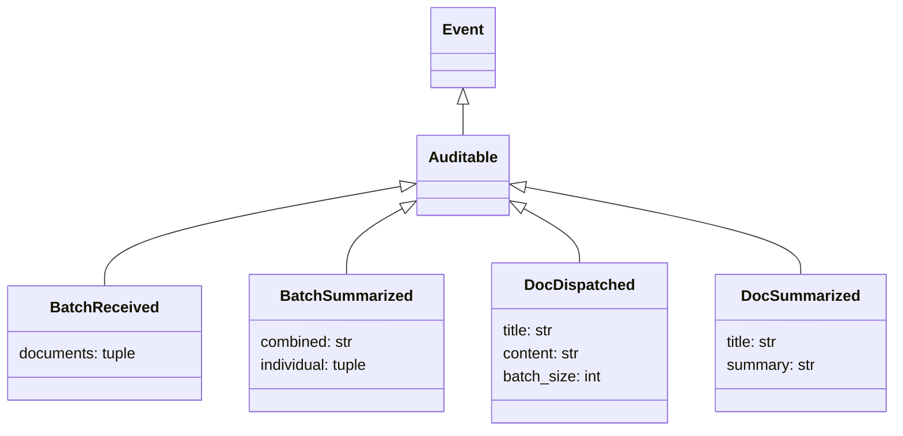

<!-- Auto-generated by scripts/generate_mermaid.py — do not edit -->
# Map Reduce — Type Hierarchy

```mermaid
classDiagram
    class Auditable
    class BatchReceived {
        documents: tuple
    }
    class BatchSummarized {
        combined: str
        individual: tuple
    }
    class DocDispatched {
        title: str
        content: str
        batch_size: int
    }
    class DocSummarized {
        title: str
        summary: str
    }
    class Event
    Auditable <|-- BatchReceived
    Auditable <|-- BatchSummarized
    Auditable <|-- DocDispatched
    Auditable <|-- DocSummarized
    Event <|-- Auditable
```
