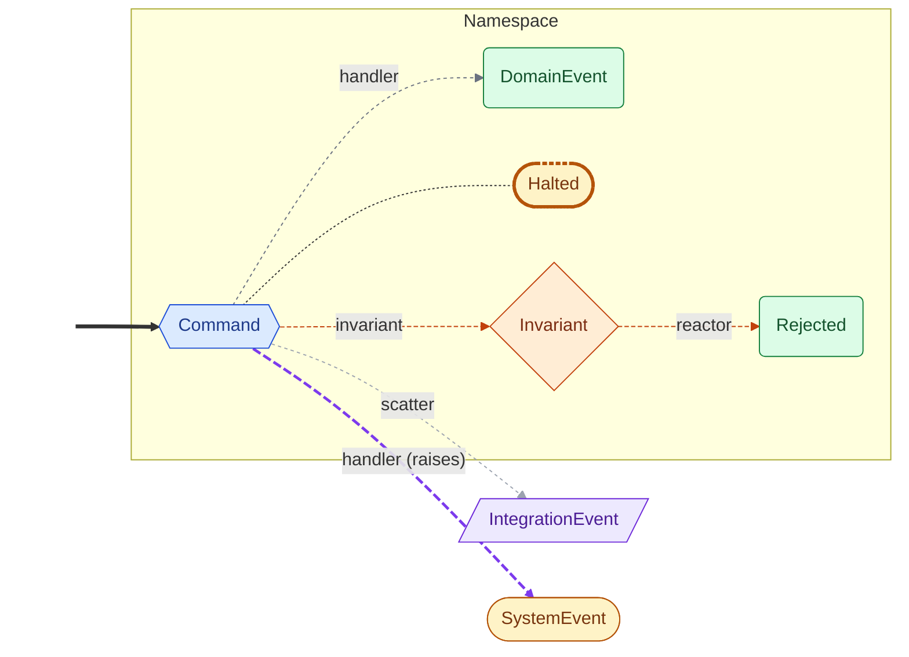
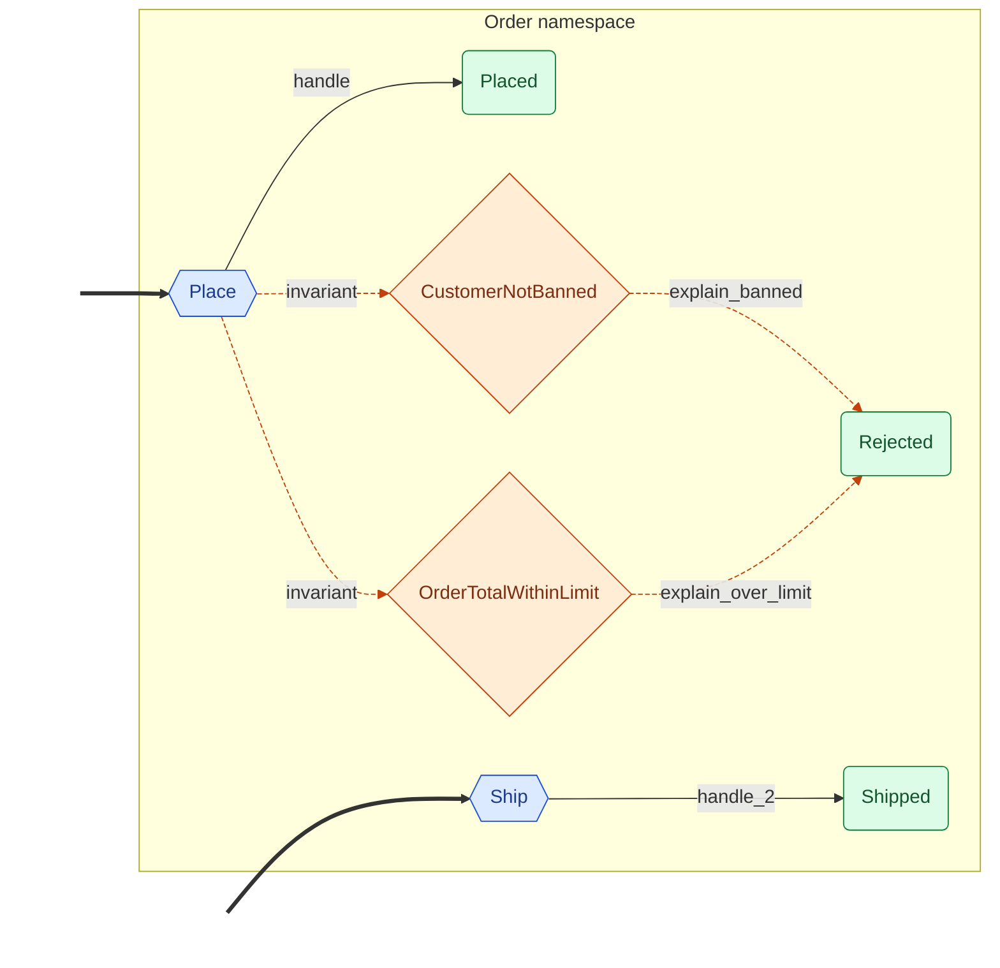

<!-- Auto-generated by scripts/generate_mermaid.py — do not edit -->
# Order

<details markdown="1">
<summary>🗝️ Diagram vocabulary</summary>



</details>

## Diagram

Event flow via command handlers and policies, with dashed ownership arrows filling in declared outcomes that no handler produces directly.



## Choreography (text)

```text
Namespaces:
  Order
    Command: Place  (handlers: handle; invariant: CustomerNotBanned, OrderTotalWithinLimit)
      → Placed
    Command: Ship  (handlers: handle_2)
      → Shipped
    Event: Rejected
System events:
  InvariantViolated
Invariants:
  CustomerNotBanned  (on Place; reacted by: explain_banned)
  OrderTotalWithinLimit  (on Place; reacted by: explain_over_limit)
Policies:
  explain_banned  (InvariantViolated → Rejected)
  explain_over_limit  (InvariantViolated → Rejected)
Seed events:
  Place
  Ship
```
