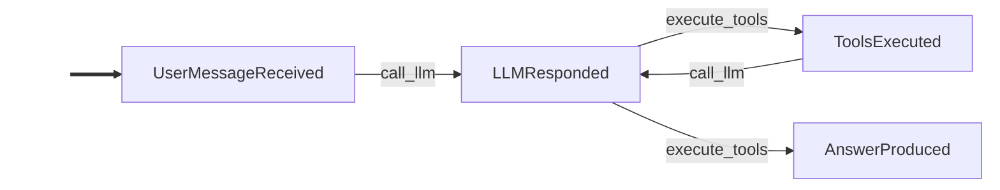
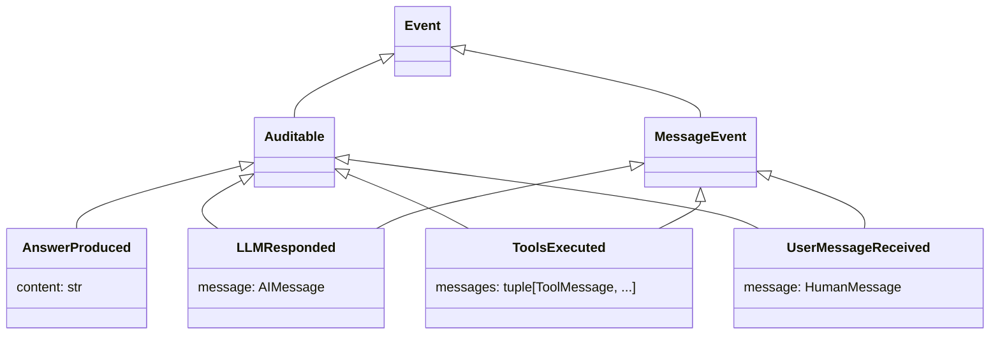

<!-- Auto-generated by scripts/generate_mermaid.py — do not edit -->
# React Agent — Event Flow

```mermaid
graph LR
    classDef entry fill:none,stroke:none,color:none
    _e0_[ ]:::entry ==> UserMessageReceived
    UserMessageReceived -->|call_llm| LLMResponded
    ToolsExecuted -->|call_llm| LLMResponded
    LLMResponded -->|execute_tools| ToolsExecuted
    LLMResponded -->|execute_tools| AnswerProduced
%% Side-effect handlers: audit_trail (Auditable)
```

## Type Hierarchy

```mermaid
classDiagram
    class AnswerProduced {
        content: str
    }
    class Auditable
    class Event
    class LLMResponded {
        message: AIMessage
    }
    class MessageEvent
    class ToolsExecuted {
        messages: tuple[ToolMessage, ...]
    }
    class UserMessageReceived {
        message: HumanMessage
    }
    Auditable <|-- AnswerProduced
    Auditable <|-- LLMResponded
    Auditable <|-- ToolsExecuted
    Auditable <|-- UserMessageReceived
    Event <|-- Auditable
    Event <|-- MessageEvent
    MessageEvent <|-- LLMResponded
    MessageEvent <|-- ToolsExecuted
    MessageEvent <|-- UserMessageReceived
```
