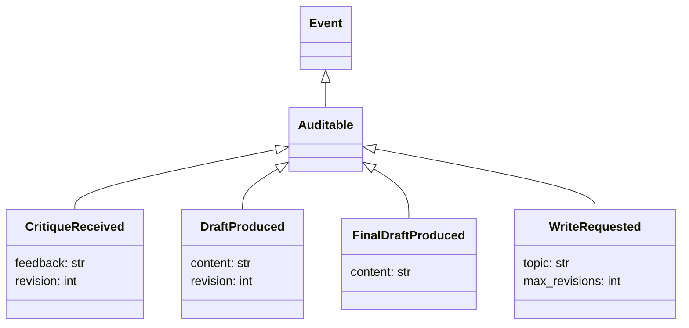

<!-- Auto-generated by scripts/generate_mermaid.py — do not edit -->
# Reflection Loop — Type Hierarchy

```mermaid
classDiagram
    class Auditable
    class CritiqueReceived {
        feedback: str
        revision: int
    }
    class DraftProduced {
        content: str
        revision: int
    }
    class Event
    class FinalDraftProduced {
        content: str
    }
    class WriteRequested {
        topic: str
        max_revisions: int
    }
    Auditable <|-- CritiqueReceived
    Auditable <|-- DraftProduced
    Auditable <|-- FinalDraftProduced
    Auditable <|-- WriteRequested
    Event <|-- Auditable
```
