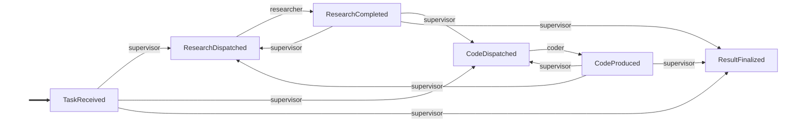

<!-- Auto-generated by scripts/generate_mermaid.py — do not edit -->
# Supervisor — Event Flow

```mermaid
graph LR
    classDef entry fill:none,stroke:none,color:none
    _e0_[ ]:::entry ==> TaskReceived
    TaskReceived -->|supervisor| ResearchDispatched
    TaskReceived -->|supervisor| CodeDispatched
    TaskReceived -->|supervisor| ResultFinalized
    ResearchCompleted -->|supervisor| ResearchDispatched
    ResearchCompleted -->|supervisor| CodeDispatched
    ResearchCompleted -->|supervisor| ResultFinalized
    CodeProduced -->|supervisor| ResearchDispatched
    CodeProduced -->|supervisor| CodeDispatched
    CodeProduced -->|supervisor| ResultFinalized
    ResearchDispatched -->|researcher| ResearchCompleted
    CodeDispatched -->|coder| CodeProduced
%% Side-effect handlers: audit_trail (Auditable)
```
