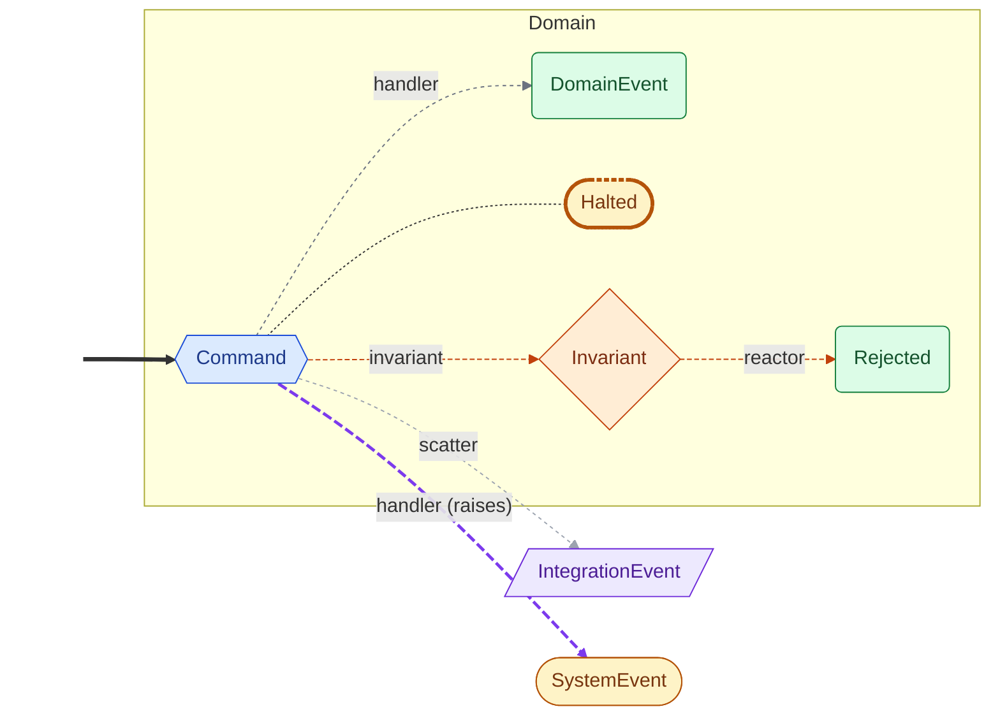
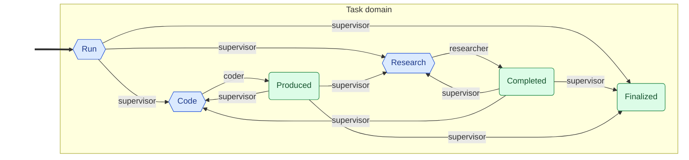

<!-- Auto-generated by scripts/generate_mermaid.py — do not edit -->
# Supervisor

<details markdown="1">
<summary>🗝️ Diagram vocabulary</summary>



</details>

## Diagram

Event flow via command handlers and policies, with dashed ownership arrows filling in declared outcomes that no handler produces directly.



## Choreography (text)

```text
Domains:
  Task
    Command: Run  (handlers: supervisor)
    Command: Research  (handlers: researcher)
      → Completed
    Command: Code  (handlers: coder)
      → Produced
    Event: Finalized
Policies:
  audit_trail  (Auditable)  [side-effect]
Seed events:
  Run
```
